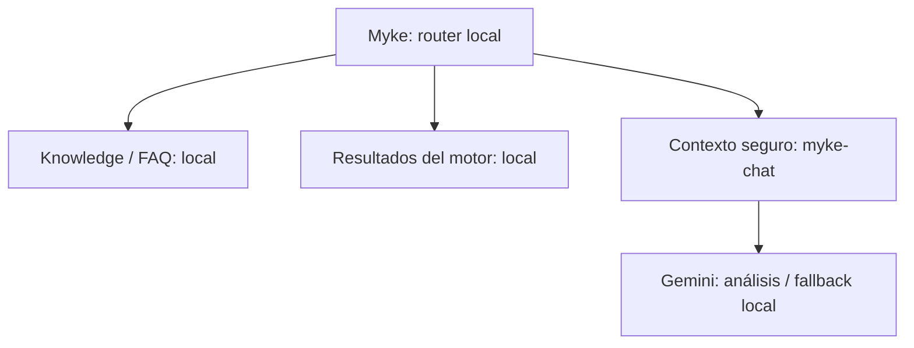

# Visteon Inventory Reconciler — 4Wall vs QAD

<!-- AGENT_CONTEXT_START -->
## Agent entrypoint — lee esto primero

Si eres un agente trabajando en este repo, **no leas todo el README ni recorras todo `src/` de entrada**. Empieza con este bloque y abre únicamente los archivos indicados para tu tarea. El resto del README es referencia detallada.

### Qué es este proyecto

PoC de Visteon para reconciliar **4Wall físico vs QAD congelado** durante inventario. Prioriza impacto en USD, conserva detalle por localidad y usa ISPBB/BOM/Cost Part para explicar diferencias. Los datos de desarrollo son de prueba; no presentar resultados como pérdidas reales sin validación operativa.

### Reglas que no debes romper

- `NET piezas = Físico total - QAD total`; `NET USD = NET piezas × costo`; conservar signo.
- `SWING = Σ ABS(Físico(localidad) - QAD(localidad)) × costo`; **no dividir entre 2**.
- Phantom: fuente autoritativa **ISPBB**; no usar prefijos.
- BOM: usar `Usage`, no `Grossed up Usage`; regla vigente `Level .2 / 0.2` + `Comp Phantom = NO`; no recursivo.
- `OBSOLETE` sale de Cost Part. `Físico > QAD` puede producir ganancia obsoleta, pero sigue dentro del NET.
- `QAD=0 && Físico>0` = material inesperado.
- `QAD>0 && Físico=0` durante conteo = **Sin físico registrado**, no pérdida final confirmada.
- Área 4Wall → catálogo 4Wall-Area → Localidad QAD. Solo normalización confirmada: `WHSE → ZWHSE`. Si no existe mapeo: `UNMAPPED`.
- React no debe duplicar fórmulas del motor. Lógica de negocio en `src/domain/`.
- No mezclar 4Wall manual con automático.
- No poner secretos en frontend, Git o variables `VITE_*`.
- GitHub Pages es manual; push a `main` no despliega Pages automáticamente. Para publicar usa `npm.cmd run deploy`, que dispara el workflow actual de Pages.
- Mantener scroll nativo en el centro. `ScrollEffects.jsx` es la única implementación del rubber band; Motion solo controla el overscroll de borde, no reemplaza `scrollTop`.

### Arquitectura mínima

```text
Fuentes → parsers → normalización → src/domain → hooks → React/UI
```

### Abre solo lo que corresponda

| Si vas a tocar… | Empieza por… |
| --- | --- |
| Fórmulas NET/SWING/flags | `src/domain/reconcileInventory.js`, `src/domain/inventoryEngine.js` |
| Phantom/BOM | `src/domain/explodeBom.js`, `src/domain/bomLibrary.js`, `src/parsers/parseBom.js` |
| Áreas/localidades | `src/domain/normalize.js`, `src/parsers/parse4WallAreas.js` |
| Hallazgos/notificaciones | lógica: `src/domain/buildDiscrepancyFindings.js`, `src/domain/notificationState.js`; UI: `src/components/shell/NotificationCenter.jsx` + `src/styles/modules/notifications-drawer.css` |
| Tabla principal | `src/components/dashboard/InventoryWorkspace.jsx`; radar en `InventoryRadar.jsx`; formatos/filtros en `inventoryWorkspaceSupport.js` |
| Trazador de pieza / aprendizaje | `src/domain/partLearningTrace.js`, `src/domain/sourceEvidence.js`; UI: `src/components/shell/PartLogicTracer.jsx` + `SourcePreviewModal.jsx`; estilos en `data-review.css` |
| LAB · Cómo funciona el motor | `src/domain/engineGuide.js`; UI: `src/components/shell/EngineGuideDrawer.jsx`, entrada en `MainMenu.jsx`; ejemplos calculados por `inventoryEngine`, separados del inventario real |
| Myke / organización virtual | Organización interna en `.agents`; ayuda pública solo de este README (`buildMykeKnowledge`); la misma conversación en chat rápido ampliable y chat completo/redimensionable en `MykePanel.jsx`; fantasma naranja arcade original y ayuda contextual con personaje desde todos los `?`. Knowledge retrieval y contexto vivo del motor, PN y evidencia locales; transporte HTTP al servicio existente y Copilot Studio Direct Line en servidor; backend único `myke-chat` con tools READ-ONLY/contexto mínimo y fallback; activación real pendiente de acceso al proyecto/secreto. Reportes manuales solo tras vista previa y confirmación explícita por la ruta existente, fuera de las tools |
| Visor de datos / evidencia | `src/components/dashboard/DataInspectionPanel.jsx`; construcción de vistas/export helpers en `dataInspectionSupport.js` |
| Fuentes/importación | lógica: `src/domain/sourceCatalog.js`, `src/services/sourceDetection.js`, `src/hooks/useReferenceFiles.js`; UI: `src/components/shell/SourcesDrawer.jsx` + `src/components/shell/sources/` |
| 4Wall automático / Bot | lógica: `src/hooks/useInventoryEngine.js`, `src/services/supabase.js`, `bot_extractor.py`, `bot_control_server.py`; UI: `src/components/shell/BotControlModal.jsx`, acceso desde navbar y `MainMenu.jsx` |
| Supabase/BOM cloud | `src/services/bomCloud.js`, `supabase/migrations/` |
| Scroll/rubber band | `src/components/visual/ScrollEffects.jsx` + `src/styles/modules/interaction-motion.css` |
| Pac-Man / LAB / rendimiento | `src/components/visual/PacmanGlyphs.jsx`, `src/components/shell/MainMenu.jsx` + `src/styles/modules/interaction-motion.css` |
| Navbar / footer | `src/components/shell/CommandHeader.jsx`, `src/components/shell/SystemFooter.jsx` + `src/styles/modules/navigation-footer.css` |
| Drawers / overlays / ayuda | componentes en `src/components/shell/` y `src/components/help/`; textos en `src/components/help/helpContent.js`; estilos en `src/styles/modules/overlays-drawers.css` |
| Fuentes visual | `src/components/shell/SourcesDrawer.jsx` + `src/styles/modules/sources-drawer.css` |
| Visores, tablas y superficies de datos | componente correspondiente + `src/styles/modules/data-review.css` |
| Base visual / dashboard general | `src/styles/modules/foundation-dashboard.css` |
| Excel/exportación | `src/services/exportInventoryWorkbook.js`, `src/services/exportBomWorkbook.js` |
| Persistencia local | `src/services/browserStorage.js` |
| Estado/gestos auxiliares de App | `src/hooks/useBotRunningStatus.js`, `src/hooks/useMobileMenuSwipe.js`; `App.jsx` queda como orquestador |
| Reglas/decisiones del proyecto | sección relevante de este `README.md` |

### Comandos

Windows corporativo:

```powershell
git pull origin main --no-edit
npm.cmd ci
npm.cmd run build
npm.cmd run dev
# publicar Pages cuando corresponda:
npm.cmd run deploy
```

Para cargar solo este contexto en otra sesión/agente:

```powershell
npm.cmd run context
```

Antes de hacer push, `npm.cmd run build` debe quedar verde. Ese build exige: ESLint sin warnings, cero módulos runtime huérfanos, cero dependencias runtime sin uso, cero CSS `vi-*` huérfano salvo clases dinámicas documentadas, verificaciones financieras/BOM/imports/Dexie/Supabase y build Vite.

### Estado técnico actual

- Myke Hybrid Intelligence vigente (07 OCT 2026): frontend local y Pages llaman a la misma `myke-chat`; sin login ni código de acceso. Consultas READ-ONLY reducen resultados del motor a un contexto permitido; el LLM explica y nunca calcula/escribe. Knowledge y motor contestan primero sin IA; solo razonamiento complejo escala a Gemini, con fallback local. Ver [Myke Hybrid Intelligence](#myke-hybrid-intelligence), que reemplaza la configuración histórica Gemini/Copilot de más abajo.

- Myke UI vigente (07 OCT 2026): chats compacto/completo flotantes con arrastre desde toda la barra, movimiento con teclado, límites de pantalla y reapertura desde el nuevo clic al personaje. El completo usa una barra mínima sin título/header; ambas vistas muestran las 21 FAQ como etiquetas con scrollbar horizontal y filtro, dejando la conversación libre. Myke queda debajo del cristal, sigue la escritura y entrega un protip diferente por clic, con viñeta lateral según el origen de apertura y desaparición a los 6.5 s. Placeholder aleatorio cada 8 s mientras está abierto; Quitar animaciones y movimiento reducido desactivan transiciones/animaciones y rotación de placeholder. Conectar IA permanece en Explorar. Se mantienen tamaños persistidos, conversación compartida, evidencia, reportes y liquid glass; posición del chat no se guarda para otra apertura.
- Recuperación Myke (07 OCT 2026): se restauraron `MykePanel.jsx` y `myke.css` de `b91208b` tras el rediseño defectuoso `494dcb5`. El chat rápido causaba `ReferenceError` al inicializar su altura; el cambio también retiraba la búsqueda FAQ del chat completo y la persistencia/teclado del arrastre. `verify-myke.mjs` ahora ejecuta render de chat rápido, completo, cerrado y Explorar en tamaños laptop/tablet/móvil; sustituye solo los shells DOM de portal/rubber band. Estas pruebas no reemplazan pruebas de interacción en navegador.
- React 19 + Vite 8 + Tailwind 3.
- Supabase/PostgreSQL + Dexie/IndexedDB.
- TanStack Virtual en la tabla grande.
- El scroll normal es nativo. Motion usa `useSpring` únicamente para rubber band/overscroll y transiciones puntuales del shell; nunca sustituye `scrollTop`.
- SheetJS fijado localmente en `vendor/xlsx-0.20.3.tgz`.
- Paneles pesados usan `DeferredPanel` + `React.lazy`: se cargan al primer uso, conservando las búsquedas/selecciones que antes persistían al cerrar. Vidrio ligero y Quitar animaciones son preferencias independientes; no cambian scroll ni cálculos.
- `README.md` es la fuente de verdad de reglas, arquitectura y decisiones del proyecto. La coordinación de la organización virtual vive en [`.agents/README.md`](.agents/README.md); los agentes leen después [`.agents/AGENTS.md`](.agents/AGENTS.md) y solo los roles/contratos necesarios para su tarea.

### Handoff UI actual — 02 OCT 2026

- **No eliminar funcionalidad para "optimizar".** Se puede reducir memoria/composición o simplificar CSS, pero funciones existentes deben conservarse salvo instrucción explícita.
- Navbar: `CommandHeader.jsx` muestra logo Visteon + 179A, estado rápido de 4Wall, hora de actualización y acciones esenciales. Debajo vive **Flujo de datos**, que se repliega al bajar y reaparece al subir con spring/histéresis.
- Rubber band: scroll medio 100% nativo; Motion spring en bordes. Configuración vigente: `stiffness 520 / damping 34 / mass .55`; arriba ~54 px y abajo ~42 px. **Ambos bordes usan exactamente la misma acumulación, guard de momentum, handoff, release de 46 ms y spring; solo cambia la amplitud visual máxima inferior.** No volver a crear una ruta/timer/impulso exclusivo para abajo ni transformar el elemento que posee el scroll.
- Pac-Man ambiental continúa durante scroll/rubber band cuando está habilitado. El menú guarda preferencias persistentes en **RENDIMIENTO**: Pac-Man puede apagarse por separado y **Quitar animaciones** pausa movimiento decorativo/transiciones sin quitar scroll ni rubber band. **LAB → Ver animación** sigue siendo una vista explícita a pantalla completa.
- **Bot 4Wall**: el mismo control seguro se abre desde navbar o hamburguesa. El menú muestra estado rápido CORRIENDO/ABRIR y el drawer del bot incluye una animación de scanner puramente visual; proceso, PID y snapshot siempre provienen del controlador real, no de la animación.
- **Ayuda**: `HelpButton` centraliza los `?` en el drawer lateral `HelpDrawer`, también desde portales. Myke animado acompaña la explicación; Preguntarle a Myke abre el chat rápido. Reutiliza `helpContent` y el visor común.
- Footer: está **pegado al final del dashboard**, con logo Visteon, `/reynosoch`, Fuentes/Calidad/Entorno/Versión centrados, snapshot y créditos lowkey. El botón **Reportar** permanece disponible también al llegar al footer; el acceso flotante conserva su espacio.
- Fuentes: `SourcesDrawer.jsx` usa entrada universal multiarquivo, filas compactas de estado y resultados de carga colapsados: muestra 3 y luego **Ver más / Ver menos**. BOM conserva lista/preview/borrado controlado y BOM Focus.
- El drawer de Fuentes fue reconstruido recientemente; cualquier siguiente ajuste debe ser **visual/ergonómico**, no volver a tarjetas grandes ni desplegar todos los archivos de golpe.
- Antes de editar UI, revisar los últimos commits de `main` porque puede haber trabajo concurrente de otros agentes.

**Solo si tu tarea requiere contexto adicional, continúa con la sección correspondiente abajo.**
<!-- AGENT_CONTEXT_END -->


> **Fuente de verdad del proyecto:** reglas de inventario, decisiones del dominio, pendientes, seguridad, arquitectura y operación de la aplicación deben mantenerse en este README. [`.agents`](.agents/README.md) define responsabilidades y coordinación del trabajo entre humanos/agentes, sin sustituir ni duplicar las reglas del reconciliador.

Dashboard web para apoyar la conciliación del inventario físico de planta durante el día de inventario. El sistema compara el físico proveniente de **4Wall** contra el congelado de **QAD**, incorpora referencias de planeación, BOM y costos, y presenta diferencias en piezas y dólares para las juntas periódicas de Finanzas.

> **Importante:** los archivos usados actualmente para desarrollo y demostración son archivos de prueba. Las discrepancias mostradas por el sistema no deben interpretarse como pérdidas reales de planta.

## Objetivo operativo

Durante el inventario físico, Finanzas necesita detectar temprano qué Part Numbers requieren revisión sin esperar hasta el cierre nocturno. La aplicación prioriza impacto en USD, conserva el detalle por localidad y separa diferencias financieras de problemas de calidad de datos.

El flujo esperado es:

1. Cargar los archivos de referencia congelados.
2. Actualizar el físico vigente de 4Wall.
3. Revisar impacto financiero y discrepancias por investigar.
4. Abrir evidencia por Part Number/localidad.
5. Guardar un corte para la siguiente junta.
6. Comparar únicamente cortes válidos y compatibles.

## Estado actual

La aplicación incluye:

- Conciliación 4Wall vs QAD por Part Number y localidad.
- NET / diferencia total en dólares, pérdida bruta y ganancia bruta.
- SWING por localidad.
- Identificación de Phantom desde ISPBB.
- Referencias BOM sin crear ajustes por una coincidencia simple.
- Identificación de obsoletos desde Cost Part.
- Detección de material inesperado y QAD positivo sin físico.
- Motor de **Discrepancias por investigar** separado de React.
- Alertas operativas con IDs estables por inventario.
- Preguntas de lógica documentadas únicamente en este README; no ocupan espacio en la interfaz de notificaciones.
- Historial de juntas almacenado localmente en IndexedDB.
- Exportación de un Excel único para juntas, con dashboard, fecha/hora, conciliación, localidades, hallazgos, 4Wall, fuentes y guía de interpretación.
- Control local del bot con estado de proceso y último resultado publicado.
- Manejo de fallos de almacenamiento y Error Boundary.
- Diseño responsive para laptop, iPad y móvil.
- Referencias visuales sutiles de Pac-Man.
- Drawers laterales compactos y legibles. **Fuentes** y **Notificaciones** comparten el mismo lenguaje industrial: panel derecho de 560 px máx., header compacto, listas densas y naranja solo como acento.
- `Estado de datos` abre un visor tipo hoja de cálculo con letras de columna, números de fila, búsqueda, pestaña de hoja y navegación de regreso al hallazgo.
- `Posible ubicación` explica su cálculo en UI y permite abrir el PN directamente en el visor por localidad; los vínculos de cantidades son evidencia navegable, no ajustes automáticos.
- La animación ambiental de Pac-Man puede activarse o desactivarse desde **RENDIMIENTO** en el menú; la preferencia se guarda en este dispositivo. **Quitar animaciones** pausa Pac-Man, fantasmas y transiciones decorativas sin tocar el scroll/rubber band. El LAB permite verla a pantalla completa de forma explícita.
- Navbar compacto orientado a lectura rápida: estado de 4Wall, actualización, Fuentes, notificaciones, bot, refresh y menú; el detalle secundario vive en **Flujo de datos** y se repliega con el scroll.
- Footer de sistema pegado al final del dashboard con estado de Fuentes/Calidad/Entorno/Versión, snapshot, logo Visteon, `/reynosoch` y créditos discretos.

## Arquitectura

```text
RAW / FUENTES
   ↓
PARSERS
   ↓
NORMALIZACIÓN
   ↓
MOTOR DE DOMINIO
   ├── conciliación
   ├── SWING
   ├── Phantom / BOM
   └── hallazgos
   ↓
RESUMEN FINANCIERO
   ↓
REACT / UI
```

React presenta resultados; las reglas financieras y de hallazgos viven en `src/domain`. El scroll principal sigue siendo nativo; Motion solo suaviza el rubber band en los bordes y algunas transiciones del shell. La tabla grande de conciliación usa TanStack Virtual para mantener pequeño el DOM.

### Estructura principal

```text
src/
├── App.jsx
├── domain/
│   ├── normalize.js
│   ├── explodeBom.js
│   ├── reconcileInventory.js
│   ├── inventoryEngine.js
│   ├── buildDiscrepancyFindings.js
│   ├── notificationState.js
│   └── visibleAlerts.js
├── parsers/
│   ├── parseDelimitedFile.js
│   ├── parse4WallAreas.js
│   ├── parse4WallScans.js
│   ├── parseQad32.js
│   ├── parseISPBB.js
│   ├── parseBom.js
│   └── parseCostPart.js
├── hooks/
│   ├── useInventoryEngine.js
│   └── useReferenceFiles.js
├── services/
│   ├── supabase.js
│   └── browserStorage.js
├── components/
│   ├── dashboard/
│   ├── detail/
│   ├── help/
│   ├── shell/
│   └── visual/
└── styles/
    ├── app.css                 # entrypoint; solo imports ordenados
    └── modules/
        ├── foundation-dashboard.css  # variables, botones, cards y dashboard base
        ├── overlays-drawers.css      # drawers, overlays, ayuda y modales
        ├── data-review.css           # tablas, Excel-like views, notificaciones y revisión
        ├── interaction-motion.css    # scroll, rubber band, Motion, Pac-Man y LAB
        ├── navigation-footer.css     # navbar, flujo de datos y footer
        ├── sources-drawer.css        # workspace visual de Fuentes
        └── notifications-drawer.css  # workspace visual de Notificaciones
```

## Fuentes de datos

| Fuente | Uso actual |
| --- | --- |
| 4Wall | Físico vigente: PN, cantidad y área de escaneo |
| 4Wall-Area | Traducción de área 4Wall a localidad QAD |
| QAD 3.2 | Inventario congelado por PN y localidad |
| ISPBB 50.1.4.22 | Fuente autoritativa para saber si un PN es Phantom |
| BOM | Relación Parent → Component y Usage |
| Cost Part Browse | Cost Total y Status para valoración financiera |

Los archivos de referencia se cargan manualmente en el navegador y se validan por columnas requeridas. También se calcula una huella SHA-256 para detectar si las referencias cambiaron.

### Workspace de Fuentes

El drawer **Fuentes** funciona como un workspace de entrada y revisión:

- La **Entrada universal** acepta `.txt`, `.csv`, `.xlsx` y respaldos BOM `.json`.
- Puede recibir varios archivos mezclados en una sola selección o por drag & drop.
- Primero intenta reconocer la fuente por nombre; si el nombre no ayuda, inspecciona encabezados/columnas.
- XLSX se inspecciona una sola vez para identificar el tipo antes de pasar al parser normal.
- Cada archivo reconocido se carga usando el mismo validador de columnas que la carga individual.
- Si el bot 4Wall está corriendo, solo se bloquea un archivo detectado como **escaneo 4Wall manual**; QAD, Áreas, ISPBB, Cost y BOM pueden seguir cargándose.
- QAD, Áreas, ISPBB, Cost y 4Wall manual son fuentes de **sesión**: pueden reemplazarse o quitarse sin escribir esos archivos a Supabase.
- BOM mantiene el comportamiento especial existente: biblioteca incremental local + respaldo compartido en Supabase cuando la conexión/permisos están disponibles.
- El borrado BOM sigue siendo controlado: se confirma el archivo exacto y se usa su fingerprint/revisión para evitar borrar una versión equivocada.
- **BOM Focus** filtra por coincidencia exacta de `Parent Item`, muestra cuántas filas y archivos contienen ese PN y abre el visor/descarga solo con esa selección.
- La UI de Fuentes usa filas compactas en lugar de cards grandes. La carga masiva enseña solo los primeros **3 resultados** y ofrece **Ver más / Ver menos** cuando se seleccionan muchos archivos.
- No volver a renderizar todos los archivos cargados al inicio del drawer: la prioridad es que el estado de cada fuente sea visible en pocos segundos y que las listas extensas sean expandibles.

El catálogo de tipos y columnas vive en `src/domain/sourceCatalog.js`; la detección universal vive en `src/services/sourceDetection.js`. No duplicar esquemas de columnas dentro de la UI.

### Limitación actual del 4Wall en vivo

La consulta web actual recibe de Supabase:

- `id`
- `numero_parte`
- `cantidad`
- `area_escaneo`

Por lo tanto, la interfaz **no debe inventar** Ticket/FIFO, auditor, responsable o fecha si esos campos no llegaron por el pipeline publicado.

## Reglas financieras actuales

### Diferencia total / NET

```text
NET piezas = Físico total - QAD total
NET USD    = NET piezas × costo unitario
```

El signo se conserva. El NET representa la diferencia total del PN; no se usa valor absoluto.

### Pérdida y ganancia bruta

- NET negativo → pérdida bruta.
- NET positivo → ganancia bruta.
- Un PN sin costo confiable no se presenta como USD 0 válido.

### SWING

La implementación vigente compara localidad contra localidad:

```text
SWING piezas = Σ ABS(Físico(localidad) - QAD(localidad))
SWING USD    = SWING piezas × costo unitario
```

No se divide entre dos. El alcance final de localidades para SWING sigue pendiente de confirmación con el departamento.

### Phantom

- No se identifica por prefijos del Part Number.
- La fuente autoritativa es ISPBB.
- BOM usa `Usage`, no `Grossed up Usage`.
- La explosión actual parte de escaneos phantom YES y selecciona componentes NO de nivel .2; no es recursiva.
- Una coincidencia en BOM por sí sola no debe crear un ajuste financiero nuevo.

### Obsoleto

Se toma de `Status = OBSOLETE` en Cost Part. Un sobrante obsoleto puede aislarse para revisión, pero sigue formando parte del NET del PN.

### Material inesperado

Si Físico > 0 y QAD = 0, se marca para investigar. El motor distingue cuando el PN está presente con saldo cero de cuando está ausente del archivo QAD filtrado.

### Sin físico registrado

QAD > 0 y Físico = 0 se muestra como **Sin físico registrado**. Durante el conteo intradía esto no significa automáticamente una pérdida confirmada.

## Discrepancias por investigar

`src/domain/buildDiscrepancyFindings.js` genera hallazgos con IDs estables por inventario, regla, PN y localidad.

Tipos actuales:

- Diferencia de cantidad.
- Sin físico registrado.
- Material inesperado.
- Posible ubicación.
- Falta un costo confiable.
- Área/localidad sin mapeo.
- Revisión BOM.
- Cambio inusual entre cortes comparables.

Un mismo PN puede tener varias etiquetas, pero su NET no se suma varias veces.

### Posible ubicación

Para cada localidad:

```text
deltaLocalidad = físicoLocalidad - qadLocalidad
sobrantes = suma(deltas positivos)
faltantes = suma(abs(deltas negativos))
potencialmenteCompensable = min(sobrantes, faltantes)
```

Solo es una pista de investigación. No afirma un traslado y no modifica NET ni SWING.

## Costos y calidad de datos

Cost Part distingue:

- costo válido;
- costo ausente;
- costo inválido;
- costo contradictorio.

Un valor vacío o `"$"` no debe convertirse silenciosamente en cero. Un cero numérico real se conserva como cero.

Si una columna necesaria para calcular está duplicada de forma ambigua, la fuente debe revisarse en lugar de escoger una columna silenciosamente.

## Inventarios, cortes e historial

El **nombre del inventario** y su **ID interno** son independientes. Renombrar no cambia los IDs de los hallazgos.

Los cortes grandes y alertas se guardan en IndexedDB. `localStorage` se reserva para preferencias pequeñas. La sección de juntas expone solo dos acciones principales: **Guardar resultados en navegador** y **Exportar Excel completo**.

Cada corte conserva información suficiente para validar comparabilidad, incluyendo:

- inventario;
- versión de reglas;
- referencias/huellas;
- estado del snapshot;
- resumen;
- detalle requerido para comparación.

Si IndexedDB falla, la aplicación intenta conservar el trabajo en memoria y muestra una advertencia. El historial local **no se sincroniza entre computadoras**. El Excel sirve como copia compartible del corte y contiene una hoja `Dashboard` pensada para un lector que no conoce el desarrollo: cada KPI incluye una explicación de qué significa y cómo debe leerse en junta. También incluye `Conciliacion`, `Localidades`, `Hallazgos`, `4Wall actual`, `Fuentes` y `Guia`.

Crear otro inventario no borra los archivos de referencia que ya están cargados en la sesión.

## Preguntas pendientes con el departamento

Las preguntas vigentes no se muestran en la interfaz. Se documentan en este README para revisarlas fuera del flujo operativo del dashboard. Se confirmaron USD, actualización por reemplazo de escaneos, Top 10 y selección BOM nivel .2 / componente NO. No volver a presentar esas decisiones como pendientes.

## Bot 4Wall

El frontend usa `VITE_BOT_CONTROL_URL` para hablar con el controlador. GitHub Pages no puede ejecutar Python: `bot_control_server.py` y `bot_extractor.py` deben correr en el equipo/servidor autorizado que tenga acceso a 4Wall. El controlador usa `BOT_CONTROL_PASSWORD` y `BOT_CONTROL_ORIGIN`; ninguna contraseña debe vivir en una variable `VITE_*`.

`bot_extractor.py` usa Playwright para entrar al 4Wall interno, exportar el reporte, limpiar cantidades inválidas y publicar un corte mediante el RPC de Supabase.

`bot_control_server.py` controla el arranque del extractor localmente:

- evita arranques concurrentes;
- valida que exista el extractor;
- diferencia solicitud aceptada de snapshot publicado;
- expone estado y último resultado sin devolver credenciales;\n- permite detener de forma controlada el proceso antes de usar escaneos manuales;
- usa contraseña desde `BOT_CONTROL_PASSWORD`;
- por defecto solo escucha en loopback.

No guardar usuarios, contraseñas ni `service_role` dentro del frontend o del repositorio. `WALL_USER`, `WALL_PASS`, `SUPABASE_SERVICE_KEY` y `BOT_CONTROL_PASSWORD` pertenecen únicamente al entorno del bot/servidor. Si una credencial apareció alguna vez en Git, quitarla del archivo actual no la revoca: debe rotarse.

Antes de producción, un administrador de Supabase debe verificar que `anon` y `authenticated` no puedan ejecutar `reemplazar_escaneos`, que RLS esté habilitado y que la escritura del snapshot quede reservada al rol del bot/servidor.

## Metadatos de snapshot

Un snapshot es una copia de los escaneos de un momento concreto. Permite comparar ese conteo con el QAD congelado; la última consulta de la app no demuestra cuándo se extrajo el reporte original.

El extractor prepara:

- `snapshotId`
- `extractedAt`
- `publishedAt`
- `result`
- `rowCount`

La lectura frontend actual también verifica que el conjunto no cambie durante la paginación. Mientras el esquema remoto no exponga un `snapshotId` real a la consulta, el frontend indica que la antigüedad real del reporte no está confirmada.

## Desarrollo local

Requisitos:

- Node.js compatible con Vite 8.
- npm.
- Variables públicas de Supabase en `.env.local`.

En la laptop corporativa Windows se recomienda usar `npm.cmd`:

```powershell
npm.cmd install
npm.cmd run dev
```

Verificación y build:

```powershell
npm.cmd run build
```

El build ejecuta primero verificaciones de higiene del repo, módulos `src/` huérfanos, Finanzas, discrepancias, seguridad de UI, IndexedDB, XLSX, imports, reglas de junta y migraciones Supabase; después compila Vite.

## Variables del frontend

```text
VITE_SUPABASE_URL=<url del proyecto>
VITE_SUPABASE_ANON_KEY=<anon key>
```

La anon key puede existir en el frontend; la seguridad real debe depender de RLS/permisos del backend. Nunca colocar una `service_role` en React.

## Despliegue

Vite usa la base:

```text
/reconciliador-visteon/
```

GitHub Pages está configurado para **despliegue manual**. Hacer push a `main` no publica automáticamente el dashboard.

Antes de publicar:

```powershell
git pull --ff-only origin main
npm.cmd install
npm.cmd run build
```

La publicación debe ejecutarse únicamente cuando se haya decidido qué versión se quiere mostrar.

## Diseño

La UI sigue la identidad visual de Visteon:

- Roboto.
- Visteon Orange `#F5821F`.
- Dark Blue `#00293F` / `#113B5E`.
- Prioridad visual para impacto financiero.
- Responsive para monitor/laptop, iPad y móvil.

La referencia Pac-Man es ambiental, no arcade: normalmente Pac-Man huye mientras los Phantoms lo persiguen en fila. En momentos aleatorios aparece un power pellet; cuando Pac-Man lo alcanza, los fantasmas se vuelven azules y huyen en fila. El poder dura unos segundos y después vuelve la persecución normal. `prefers-reduced-motion` desactiva esta animación.

## Principios que no deben romperse

- No inventar autorizaciones de Finanzas.
- No tratar QAD sin físico como pérdida confirmada durante un conteo incompleto.
- No usar prefijos para identificar Phantom.
- No usar `Grossed up Usage` como Usage.
- No dividir SWING entre dos.
- No convertir un área desconocida automáticamente a Piso.
- No convertir costos o cantidades inválidas silenciosamente a cero.
- No duplicar NET porque un PN tenga varias alertas.
- No presentar datos de prueba como pérdidas reales.
- No publicar automáticamente cambios a GitHub Pages.

## Pendientes técnicos/funcionales

- Confirmar alcance final de localidades/sitios con el departamento.
- Confirmar costo y moneda oficiales.
- Confirmar interpretación operativa final de SWING.
- Validar la regla acordada (.2 / NO) con los nuevos escaneos y BOM de prueba.
- Definir una fuente válida de cierre de conteo.
- Definir identidad oficial de registros/reconteos.
- Exponer metadatos de snapshot de extremo a extremo en el backend.
- Si se requieren Ticket/auditor/responsable/fecha en vivo, ampliar de forma coordinada bot + tabla/RPC + consulta frontend.
- Migrar historial compartido a una base central si las juntas necesitan ver los mismos cortes desde varios equipos.

---

Proyecto PoC de conciliación de inventario para Visteon. El dashboard apoya la investigación; no sustituye la validación operativa ni las decisiones de Finanzas.

## UX de investigación y trazabilidad

La interfaz conserva una estética líquida Visteon, pero las superficies de lectura son deliberadamente más opacas y evitan blur costoso en el hot path. Los reflejos/gradientes son estáticos; el rendimiento y la legibilidad financiera tienen prioridad.

El menú hamburguesa contiene una sección **LAB** con el Trazador de pieza y **Ver animación**. Ver animación oculta temporalmente todo el dashboard y deja únicamente el ambiente Pac-Man, con salida por `×` o `Esc`; no altera la preferencia persistente de Pac-Man.

### Discrepancias por investigar

- El encabezado ya no asume una frecuencia fija de juntas.
- El botón `?` abre un menú compacto con la explicación de Posible ubicación, Cantidad, Calidad de datos y Falta de costo.
- Cada hallazgo abre un drawer con `×` y un botón **Ver evidencia en Excel**.
- Para `SIN FÍSICO`, la evidencia abre QAD y 4Wall lado a lado y avisa cuando el snapshot físico no contiene el PN.
- Otras reglas abren las fuentes relevantes: Cost Part, BOM, diccionario 4Wall-Area o comparación 4Wall/QAD según corresponda.
- El panel puede exportarse por separado a `Visteon-Discrepancias-*.xlsx`.

### Visor tipo Excel

`Estado de datos` usa un visor con letras de columna, números de fila, barra de búsqueda y pestaña de hoja.

Para 4Wall, el pipeline nuevo preserva el registro original en `raw_record` y guarda en `source_columns` qué columnas del archivo fueron utilizadas como Part Number, cantidad y área. El visor marca esas columnas con `★ USADO`.

> Compatibilidad: los snapshots publicados antes de esta ampliación solo contienen `id`, `numero_parte`, `cantidad` y `area_escaneo`. El visor los muestra sin inventar columnas faltantes.

La migración preparada para habilitar el registro original completo está en:

```text
supabase/migrations/20260929_preserve_4wall_raw_record.sql
```

Debe aplicarse con permisos administrativos de Supabase. Después, el bot debe publicar un snapshot nuevo para que aparezcan las columnas originales completas.

### Excel ejecutivo

`Visteon-Inventario-*.xlsx` mantiene siete hojas, pero el Dashboard ya no incluye una columna de “Cómo leerlo en junta” ni preguntas pendientes con el departamento.

La hoja `Conciliacion` identifica en cada encabezado la fuente que alimenta el dato, por ejemplo 4Wall, QAD 3.2, Cost Part, ISPBB o BOM.

La hoja `Localidades` muestra de forma explícita:

```text
Área 4Wall → diccionario 4Wall-Area → Localidad QAD
```

y después compara el físico contra la cantidad de esa misma Localidad QAD.

### Radar lateral

En el área de conciliación, el bloque lateral se mantiene visible mientras se recorre la tabla e incluye:

- `PHANTOM RADAR`: principales Phantom por impacto NET absoluto.
- `OBSOLETOS +`: principales materiales obsoletos con sobrante valorizado.

Ambos bloques abren el detalle normal del Part Number.

## Acuerdos de la junta del 29 de septiembre de 2026

Esta sección reemplaza las reglas anteriores de explosión BOM. Los archivos de la junta son ejemplos de prueba, no el congelado oficial del inventario.

### Escaneos y phantoms

1. Leer el reporte completo de 4Wall. Cargar otro reporte **reemplaza** el anterior; no acumula escaneos ni reconteos. Una reducción de filas es válida (se reportó una reducción a 4,943 por preconteos; ese archivo nuevo aún debe cargarse y verificarse).
2. ISPBB `Phantom=YES` identifica el **número escaneado** que se debe convertir. Los escaneos NO se reconocen directamente. Sin definición ISPBB, se mantiene la revisión de catálogo; no se infieren prefijos.
3. Para un escaneo YES buscar su número en `Parent Item` (B).
4. Usar exclusivamente `Level` (F) `.2` / `0.2` (también `0,2` al importar) y `Comp Phantom` (M) `NO`. Ignorar nivel 1 y niveles inferiores, componentes YES y etiquetas desconocidas. **No es una multiplicación por 0.2.**
5. Multiplicar `Usage` (I) por la cantidad escaneada del phantom. No usar `Grossed up Usage`, no hacer recursión. Conservar la localidad del escaneo de origen.
6. Por componente: físico reconocido = escaneos directos NO phantom + aportaciones de BOM. El escaneo original del phantom se conserva en el detalle, pero aporta cero como físico directo. QAD nunca se reescribe a cero; un phantom con saldo QAD abre una alerta.
7. NET piezas = físico reconocido − QAD. NET USD = NET piezas × costo. SWING conserva la suma absoluta por localidad sin dividir entre dos.

Ejemplo de la junta: 48 escaneos de `VPTBFF-10849-ABT`. Para sus filas válidas, Usage 5 produce 240; Usage 0.0025 produce 0.12; Usage 8 produce 384. El Excel tiene 15 filas aplicables. Las fórmulas arrastradas a otros niveles en ese Excel **no son reglas válidas**. Z–AD son columnas añadidas para explicar aportación BOM, escaneos directos, total, QAD y diferencia; no vienen en el TXT original.

### BOM acumulativos y archivos originales

- Se admite el TXT separado por `|` tal como llega por correo, además de CSV. No hace falta convertirlo en Excel. No se importan fórmulas del Excel de demostración.
- Agregar dos BOM a una colección de 300 conserva los anteriores. La colección y sus archivos originales interpretados se guardan con Dexie en este navegador y se recuperan al recargar.
- La misma versión de un Parent Item no se suma dos veces. Un archivo que cambia un BOM existente se rechaza completo con un mensaje, manteniendo la colección anterior. No se elige silenciosamente una versión ni se deduplican componentes legítimos dentro de un BOM.
- `RESPALDAR BOM` descarga la colección como JSON, que se puede volver a cargar con AGREGAR BOM. Conservar también los TXT originales. Quitar las demás fuentes no borra la colección BOM.
- Falta BOM y BOM existente sin filas aplicables son estados diferentes. Ambos conservan el escaneo pendiente y advierten que las cantidades aún pueden estar incompletas.
- **Actualización del 30/09:** hay sincronización BOM con Supabase, sujeta a activar las tablas y autorizar las cuentas. Ver instrucciones al final. Dexie conserva la copia local.

### Uso de escaneos manuales

En Fuentes, cargar `Escaneos 4Wall (archivo manual)`. El encabezado identifica este modo. La consulta automática se pausa para que una respuesta del bot no reemplace el archivo seleccionado. El botón de actualizar no sustituye el archivo manual; usar REEMPLAZAR en Fuentes. Quitar el archivo vuelve a la consulta del bot. No se envía el archivo manual a la base remota.

### Juntas y costos

- Dos listas Top 10, pérdidas y ganancias por revisar, ordenadas por NET USD por número de parte. Incluyen el universo QAD del comparativo y señalan cuándo todavía no hay conteo; no son pérdidas finales confirmadas.
- Importes en USD. Costo unitario mostrado con dos decimales; cálculo con precisión original (un costo menor a un centavo no se convierte en cero antes de multiplicar).
- Costo cero se señala, conservando cantidades; no se interpreta como ausencia de inventario ni se inventa una causa de negociación.
- Los resultados guardados con la regla anterior no se comparan como si usaran la nueva regla; se incrementó la versión de cálculo.
- Las preguntas pendientes se mantienen en este README, no mezcladas con alertas operativas. Cualquier cambio de alcance, reporte QAD, versión BOM, costo o almacenamiento compartido debe documentarse aquí antes de cambiar lógica.
- No se inventa el cierre de un área. Una localidad QAD puede agrupar varias áreas 4Wall. El filtro actual sigue en Site 179A y tipos PP/MP/FP hasta recibir los códigos que correspondan al alcance acordado.
- La contraseña se indicó con cambio cada 90 días; debe actualizarse en la configuración local del bot cuando corresponda, nunca en el repositorio. Falta confirmar qué cuenta aplica; no se programó cambio automático.

### Verificación y publicación

`npm.cmd install` y `npm.cmd run build` en Windows. Las pruebas incluyen casos sintéticos de la nueva regla, niveles ignorados, cantidades fraccionarias, conservación de QAD y acumulación/conflictos BOM.

Esta actualización se sube a **main solamente**. No ejecutar el despliegue manual de Pages hasta que se solicite. El workflow de verificación de main puede ejecutarse sin publicar Pages.


## Actualización 30/09/2026: archivos, respaldo y visor

- Se aceptan CSV, TXT delimitado y XLSX en todas las fuentes. Excel se lee directamente en memoria; no se vuelve a convertir y leer para calcular. Para repetir cargas, usar CSV (evita abrir/descomprimir un libro). TXT delimitado tiene un costo de lectura parecido; la extensión por sí sola no garantiza velocidad.
- Se busca una hoja con las columnas de la fuente entre sus primeras 50 filas. Si dos hojas coinciden, se pide separar la hoja correcta. Se conservan ceros formateados en identificadores y precisión numérica en costos. Excel no ejecuta fórmulas en esta app: necesita sus valores guardados.
- Excel se descomprime y convierte a CSV una sola vez al cargarlo. La app conserva sus filas y descarta el libro y el texto CSV temporales. Los BOM registrados se descargan como Excel (.xlsx).
- Los escaneos manuales se muestran en el visor y en el Excel exportado, con cantidad, parte, área y columnas adicionales. Reemplazan el reporte completo; no se suman al del bot.
- El visor tiene fondo opaco; Para la junta separa los dos top 10 y muestra la suma de **cada lista**, no la del inventario completo. Phantom Radar y Obsoletos + conservan sus reglas y tienen tarjetas más legibles.
- Reportar distingue errores de configuración/permisos, evita envíos simultáneos y conserva el formulario si falla. Sus opciones Tipo/Área tienen fondo y texto oscuros/claros definidos.

### Respaldo BOM sin login (01/10/2026)

La app usa `VITE_SUPABASE_URL` y `VITE_SUPABASE_ANON_KEY` para escaneos, BOM y reportes. El proyecto usado por Pages es `uukhwkywmnarcfruerpp` (`visteon-demo`). Las 97 columnas de fuentes y la limpieza de tablas se verificaron allí el 01/10/2026. El respaldo BOM sin login requiere su esquema y permiso de lectura/guardado incremental.

Aplicar las migraciones en orden histórico. Para BOM incremental/borrado, las relevantes son `supabase/migrations/20261001140733_inventory_bom_incremental_no_login.sql`, `supabase/migrations/20261001142606_inventory_source_columns.sql` y `supabase/migrations/20261001144500_inventory_bom_delete_no_login.sql`. No se necesita correo, contraseña ni habilitar usuarios anónimos en Auth. El cliente consulta el consolidado y agrega padres nuevos mediante `merge_inventory_bom`; el borrado explícito de un archivo usa `remove_inventory_bom`, exige la revisión actual y la huella SHA-256 exacta, crea una nueva revisión de respaldo y elimina las filas con la procedencia de ese archivo. Las tablas siguen sin admitir escrituras directas desde el navegador y el historial permanece privado.

El respaldo local se guarda primero en IndexedDB al agregar BOM. Para borrar, el orden se invierte deliberadamente: primero debe confirmarse la eliminación compartida en Supabase y solo entonces se actualiza IndexedDB. Si el RPC de borrado no está instalado, la X muestra un error y conserva tanto la copia local como la compartida. Al abrir la app, recuperar conexión o cada dos minutos, la colección se compara contra Supabase. Repetir un archivo no crea filas ni revisiones; una definición distinta para un padre existente sigue tratándose como conflicto. Este flujo sin login permite a quien tenga la configuración pública consultar/agregar y, una vez habilitado el RPC de borrado, eliminar un BOM con su fingerprint; por eso debe usarse solo en el entorno controlado previsto para este PoC.

REPORTAR usa `development_feedback` con permiso de inserción y sin lectura desde el navegador. Para verificarlo en el proyecto correcto, enviar un reporte de prueba y comprobarlo desde el panel administrativo. Una configuración de otro proyecto no valida la instalación local.

### Organización de UI para agentes

- `App.jsx`: orquesta estado y conecta dominios; evitar meter polling, gestos o contenido estático aquí.
- `components/help/helpContent.js`: textos y explicaciones; `HelpDrawer.jsx` solo renderiza el drawer compacto de ayuda.
- `components/dashboard/dataInspectionSupport.js`: arma vistas, columnas y exportación; `DataInspectionPanel.jsx` maneja interacción.
- `components/dashboard/inventoryWorkspaceSupport.js`: filtros y formatos; `InventoryRadar.jsx`: radar; `InventoryWorkspace.jsx`: búsqueda, virtualización y tabla.
- `components/shell/sources/sourceConfig.js`: catálogo visual de Fuentes; `SourceRow.jsx`: una fila; `SourcesDrawer.jsx`: carga masiva, BOM Focus y coordinación.
- Los motores de `src/domain/` se mantienen cohesionados a propósito: no separarlos solo por tamaño. Cambiar fórmulas exige revisar verificadores financieros.

### Rendimiento y librerías UI

- `motion` / `motion/react`: solo microinteracciones pequeñas; no reemplaza la física del scroll.
- React Bits: se toman patrones/componentes puntuales y se guardan localmente en `src/components/ui/`; no se instala una librería monolítica.
- `@tanstack/react-virtual`: virtualiza la tabla de conciliación para no montar miles de filas simultáneamente. En React 19 se usa `useFlushSync: false`.
- `src/components/visual/ScrollEffects.jsx`: mantiene scroll nativo en el centro y aplica rubber band únicamente en los extremos. No crear una segunda implementación paralela del efecto.
- `src/styles/app.css` es únicamente el entrypoint de estilos. Las reglas viven en `src/styles/modules/` con nombres por responsabilidad. Mantener el orden de imports de `app.css` porque conserva la cascada actual; no meter reglas de features directamente en el entrypoint.
- Mapa rápido CSS: dashboard/base → `foundation-dashboard.css`; drawers/ayuda → `overlays-drawers.css`; visores/tablas/notificaciones → `data-review.css`; scroll/rubber/Pac-Man → `interaction-motion.css`; navbar/footer → `navigation-footer.css`; Fuentes → `sources-drawer.css`.

### Instalación en redes corporativas

SheetJS 0.20.3 está fijado como `file:vendor/xlsx-0.20.3.tgz`, copia del paquete oficial. `npm ci` no contacta `cdn.sheetjs.com`, conserva la versión actual y mantiene la validación TLS. Ver `vendor/README.md` para origen y hash. El resto de paquetes se instala desde sus orígenes del lockfile.

### Validación de este cambio

`npm.cmd run build` también prueba importación XLSX, ceros iniciales, precisión, hojas ambiguas, escaneos manuales y conflictos entre colecciones. Las migraciones se ejecutan en Postgres local mediante PGlite para verificar permisos, reportes de solo inserción, historial y rechazo de versiones viejas. Eso no sustituye la prueba de conexión en el proyecto real.

Después de bajar main: `npm.cmd install` y `npm.cmd run dev`. GitHub Pages sigue siendo publicación manual; este cambio no lo despliega.


## Preguntas de lógica para próxima revisión

Estas preguntas se mantienen fuera del dashboard para no mezclarlas con alertas operativas:

- Definir el agrupamiento final de localidades para reportes ejecutivos (externos, docks, holds, 800 y cualquier grupo especial).
- Definir cómo presentar durante el día los Part Numbers de QAD que todavía no han sido escaneados, sin tratarlos prematuramente como pérdida confirmada.
- Mantener documentado cualquier cambio futuro de filtros QAD (Site / Item Type) antes de modificar la lógica.
- Cuando cambie una regla financiera o BOM, registrar aquí la decisión, la fecha y el responsable antes de desplegarla.


## Higiene del repositorio

Este README es la conciencia técnica; no crear `PROJECT_CONTEXT.md`, `SECURITY_REVIEW.md`, `BOT_CONTROL_SETUP.md` u otros documentos paralelos con reglas duplicadas. `.agents/` es el modelo operativo de coordinación solicitado: las decisiones de inventario siguen documentándose aquí.

El build ejecuta:

- `npm run lint` para detectar imports, variables, claves duplicadas y errores estáticos reales. Las reglas específicas de React Compiler están desactivadas porque este PoC no usa ese compilador.
- `scripts/verify-repo-clean.mjs` para bloquear backups/artefactos legacy conocidos.
- `scripts/verify-unused.mjs` para exigir que todo módulo JavaScript/JSX dentro de `src/` sea alcanzable desde `src/main.jsx`.
- `scripts/verify-runtime-deps.mjs` para evitar dependencias declaradas que nunca se importan desde el runtime.
- `scripts/audit-css-usage.mjs` para hacer fallar el build si aparece CSS `vi-*` huérfano; las únicas excepciones son clases dinámicas documentadas explícitamente.

No versionar `node_modules/`, `dist/`, `.env.local`, `inventario.db`, descargas temporales de 4Wall ni `bot_snapshot_status.json`. `dist/` es generado por Vite y se puede borrar localmente en cualquier momento.

Sí conservar aunque no aparezcan directamente en la UI: migraciones históricas, verificadores de CI, scripts del bot, `supabase/source-column-map.json`, el vendor de SheetJS y archivos claramente ligados al roadmap vigente.

### Trazador de aprendizaje y Bot — 05/10/2026

- **Trazador**: diez pasos desde escaneo hasta clasificación, con busca/dato/motivo/resultado/siguiente paso, resumen, reglas expandibles y conclusión sin IA externa. `src/domain/partLearningTrace.js` construye el caso solo para el PN seleccionado usando parsers, trace, flags y hallazgos. React no recalcula finanzas ni Phantom; `reconcileInventory` entrega SWING USD por localidad. Costo visual a dos decimales; fórmulas con precisión original.
- **Ver en fuente** reutiliza `SourcePreviewModal` + `sourceEvidence.js`: archivo/hoja/fila, columnas usadas, valor original → normalizado y motivo de cada celda. Incluye padres que aportan BOM y filas BOM excluidas. Búsqueda, filtro de evidencia/hoja, páginas de 60 filas y exportación CSV/XLSX/TXT conservada; evidencia pesada solo al abrirla.
- El lector conserva coordenadas XLSX con títulos/vacíos y líneas CSV/TXT multilínea. Parsers guardan índices aceptados. BOM guarda coordenadas en `files.rowOrigins`, fuera de las filas del contrato compartido; sin cambios de esquema/RPC. Fuentes antiguas o nombres BOM ambiguos muestran **Registro de colección**, sin inventar fila/hoja. Reimportar BOM ya registrado no rellena coordenadas antiguas.
- **Datos incompletos**: el PN puede estudiarse con fuentes faltantes, señalando resultados provisionales. Sin costo: **Sin valorar**; BOM faltante y sin filas elegibles se distinguen. QAD Phantom conserva saldo. SWING no se divide entre dos; BOM usa Usage, Level .2 / 0.2 y Comp Phantom NO, sin recursión.
- **Bot**: estado confirmado y última consulta/publicación primero; acciones y scanner conservados, errores visibles y timeout. Requiere `VITE_BOT_CONTROL_URL` y controlador accesible; el frontend no ejecuta Python. Tipografía y controles adaptados a iPad. Esc cierra solo el visor superior. `ScrollEffects`, física Motion, Pac-Man, navbar y footer intactos; solo el CSS del trazador se trasladó de `interaction-motion.css` a `data-review.css`.
- `verify-tracer.mjs` entra al build/CI: finanzas, BOM directo/derivado, filtros, faltantes, coordenadas y compatibilidad. Revisión local con datos sintéticos a 1366, 1024, 768 y 390 px. Pages sigue manual.

### Origen del PN, hojas visuales y borde inferior — 05/10/2026

- La lista inicial del trazador conserva el orden del motor por NET absoluto y explica su universo: 4Wall aceptado, QAD aceptado o componente generado por BOM. Cost Part/ISPBB solos no agregan candidatos. `getPartEntryOrigins` lee mapas aceptados (incluidos saldos cero); el drawer identifica archivos/snapshot activos y, para cada PN, los caminos de entrada y la fuente de descripción. Cost Part tiene precedencia incluso con descripción vacía.
- Seleccionar/reabrir el caso lleva el drawer al inicio, con resumen enfocado sin salto y encabezado/cierre accesibles. Los pasos muestran hasta tres filas originales por fuente mediante `buildEvidenceExcerpt`, con acceso directo por índice, sin recorrer el archivo completo. `SourceEvidenceSheet` es el renderer compartido con el visor paginado; celdas muestran original → normalizado y motivo. Son datos reales, no capturas inventadas. Sin archivo/fila/coordenada se informa la ausencia.
- `ScrollEffects` consulta el rango nativo actual al evaluar bordes/handoff y usar el rail. El encabezado replegable está fuera del contenido observado: su cambio de altura podía dejar el fondo cacheado por encima del real después de F5. La corrección comparte camino arriba/abajo y conserva spring, amplitudes, momentum y release; sin listeners globales nuevos ni cambios a navbar/footer/Pac-Man.
- Verificación local: selección/reapertura, origen BOM sin escaneo, costos/fuentes faltantes, tablas, paginación y Esc en 1366/1024/768/390 px; regresión de altura cambiante con rueda/touch y retorno al reposo. Safari en iPad físico requiere comprobación en dispositivo.

### Casos recomendados, resumen con fuentes y guía del motor — 05/10/2026

- El trazador conserva buscador y propone PN reales con situaciones distintas (NET, SWING, Phantom, BOM, conteo pendiente, costo y balance). `getRecommendedPartCases` lee resultados ya calculados; selección única y acotada. La lista completa/origen abre el visor común bajo demanda y se identifica como **resultado generado**, no archivo original; los archivos BOM exactos se indican solo si la aportación los conserva.
- Cada uno de los nueve campos del resumen abre explicación, regla y archivos; NET/SWING incluyen sustitución real, costo original y desglose. Distingue **4Wall manual / automático del bot** y **QAD 3.2 congelado**. Phantom desconocido, obsolescencia sin registro y falta de definición requieren revisión; un `Missing BOM = No` no valida un BOM si Phantom sigue desconocido. Advertencias y plan de revisión salen del dominio; no ejecutan ajustes ni confirman movimientos/pérdidas.
- Los pasos son botones que desplazan/enfocan únicamente el drawer; no cambian hash ni historial (los enlaces de fragmento podían cerrar el overlay). Origen con filas compactas y entrada Motion breve, respetando Quitar animaciones. Snapshot se explica como copia de los escaneos de un momento concreto. Campos internos `raw_record`/`source_columns` no se exponen en el visor; PN sin fila aceptada permite buscar coincidencias originales sin marcarlas como utilizadas.
- **LAB → Cómo funciona el motor** es una guía independiente con seis etapas RAW→PARSERS→NORMALIZED→DOMAIN ENGINE→RECONCILIATION→UI, fuentes activas consultables y tres ejemplos explícitamente didácticos. `engineGuide.js` usa el motor de producción y las mismas fórmulas descriptivas del trazador; React presenta los resultados. Caso de localidades: 20 físico / 20 QAD en ubicaciones distintas da NET $0 y SWING $168 con costo $4.20, sin dividir entre dos. No se mezclan ejemplos con inventario real.
- Build/CI verifica candidatos, resumen/advertencias/acciones, precisión, metadatos ocultos, faltantes y ejemplos NET/SWING/Phantom. Pruebas de navegador a 1366/1024/768/390 px: diez pasos sin salir al dashboard, fuentes paginadas, guía desde LAB, Esc y transición al trazador. Sin nuevas dependencias ni cambios a scroll, Pac-Man, navbar, footer o ejecución del bot. Pages sigue manual.

## Organización virtual de ingeniería

El modelo operativo está en [`.agents/README.md`](.agents/README.md): guía humana, reglas para agentes, orquestador Engineering Manager/Product Owner, especialistas, ownership del dominio/código, derechos de decisión, contratos versionados, matriz de interacción, escalaciones y gates de entrega. Incluye plantilla de trabajo y un caso ilustrativo del trazador con evidencia; no son resultados ejecutados.

El orquestador se llama **Myke** y conserva el identificador `ORCH`. Puede adaptar puestos temporales al trabajo, manteniendo responsables y revisiones; los cambios permanentes siguen los derechos de decisión del modelo. La mascota web muestra esa organización y ofrece ayuda local sobre el reconciliador; no ejecuta tareas de ingeniería desde el dashboard.

Puede usarse con un ejecutor, varios agentes cuando la sesión lo permita, o coordinación humana. Cada revisión declara su independencia y el SHA/árbol verificado. La autoridad humana ya concedida se conserva; cambiar reglas financieras, operar datos compartidos o desplegar requiere la autoridad correspondiente. La documentación no instala un scheduler, validación automática de mensajes, autenticación empresarial ni agentes desatendidos. Los controles automáticos actuales siguen siendo `npm run build` y Verify main; Pages continúa manual.

### Myke, legibilidad y superficies — 05/10/2026

- **Reportar** está siempre accesible, incluido el footer, otros drawers y LAB de animación. Usa el overlay compartido para Escape/foco/scroll y conserva borrador, captura y envío existentes. Nuevas áreas: Trazador, visor Excel/evidencia, guía del motor/LAB, Myke, ayuda, exportación, rendimiento, scroll, menús/vidrio y footer.
- Tipografía ampliada en toda la aplicación; formularios de reporte a 16 px, controles táctiles y menús con mayor espaciado. Vidrio más denso: superficies oscuras con mayor opacidad y un blur moderado solo en el panel; encabezados/capas internas conservan lectura sin sumar filtros.
- **Vidrio ligero** en RENDIMIENTO quita blur/sombras y usa superficies sólidas. Es independiente de **Quitar animaciones** y Pac-Man, y se guarda localmente. No se cambia física Motion, scroll nativo, implementación de `ScrollEffects` ni animación Pac-Man.
- **Myke** es un fantasma vectorial con movimiento CSS pequeño, sin loop JS adicional. Chat local consultable, equipo leído de `.agents/ROLES.md` y preguntas frecuentes extraídas del README; no hay API, IA externa ni reparto real de tareas desde la página. Respeta Quitar animaciones y `prefers-reduced-motion`.
- Se reutilizan React/Motion/TanStack instalados; no se agregan librerías. Fuentes, Bot, trazador, guía y Myke se cargan al primer uso y conservan estado al cerrar; el visor de inspección se carga al abrirlo y mantiene su ciclo de cierre anterior; polling del inventario/estado del bot y notificaciones siguen activos. XLSX y evidencia mantienen carga/paginación existentes. Los cambios se verifican con fixtures/mocks; no sustituyen pruebas en Safari/iPad físico ni ejecución corporativa real de 4Wall.

- Verificación de esta actualización: navegación responsive en Chromium a 1366/1024/768/390 px, Reportar/borrador/overlays anidados, equipo/documentación de Myke, preferencias independientes y recarga/scroll rápido; 350 PN sintéticos a 1366/390 px verifican virtualización, NET/SWING, diez pasos, visor y búsqueda retenida. Safari/iPad físico y conexión IA siguen fuera de estas pruebas.

## Preguntas frecuentes de Myke

Estas respuestas son la ayuda humana que consume Myke: guía local y contexto documentado para la IA opcional. Los identificadores y palabras de búsqueda enlazan preguntas con respuestas; no sustituyen el motor ni calculan inventarios. Las referencias de datos abren el visor común de archivos disponibles, nunca un enlace al código. Si falta una fuente se indica cómo cargarla. Las respuestas generales explican reglas; una consulta PN consume `buildPartLearningTrace` y aporta las referencias usadas por el motor. No se toman cifras escritas en el chat como resultados.

### ¿Cómo uso el tablero?
<!-- myke: dashboard | tablero dashboard usar inicio ayuda comenzar filtros tabla resumen menu navegar | scans qad cost -->
Empieza en Fuentes: confirma escaneos 4Wall, QAD congelado, Áreas, ISPBB y Cost Part. Agrega BOM cuando el inventario tenga Phantom. La franja debajo de la barra superior indica qué está listo y qué falta.

En el resumen, Physical es el conteo reconocido y QAD lo esperado. NET compara el total y SWING revisa diferencias por localidad; no son dos pérdidas para sumar. Usa los filtros de la tabla para localizar un PN o una situación que requiera revisión.

Toca una pieza para revisar su detalle o escribe su PN aquí. Abre el trazador para ver el recorrido completo y «Ver en fuente» para mirar las filas. Desde Explorar puedes abrir motor, archivos y advertencias. El menú conserva historial, opciones de apariencia y bot; ocultar a Myke no quita su chat.

### ¿Qué oportunidades de mejora puedo revisar?
<!-- myke: opportunities | oportunidades oportunidad mejorar sugerencias prioridad prioridades optimizar recomendaciones | scans qad areas ispbb bom cost -->
Empieza por completar las fuentes y confirmar que pertenecen al mismo inventario. Revisa áreas sin localidad, costos ausentes o en conflicto y Phantom sin BOM utilizable: pueden impedir una valoración confiable.

Después revisa piezas sin físico registrado, material inesperado y diferencias por localidad. Escribe un PN para obtener sus advertencias y un plan basado en los datos actuales. Confirma cada hipótesis con las filas de origen antes de proponer un ajuste; una diferencia no prueba una pérdida ni un traslado.

Para mejorar la experiencia, usa filtros, el visor por páginas y Vidrio ligero cuando el dispositivo lo necesite. Las sugerencias de Myke son apoyo de revisión; no cambian reglas, inventario ni archivos.

### ¿Qué puedo hacer?
<!-- myke: capabilities | capacidades ayudar ayuda puedo hacer opciones servicios preguntas | -->
Puedo explicarte cómo funciona el reconciliador, de dónde vienen los datos, qué significan NET y SWING, cómo trabaja Phantom y qué revisar ante una advertencia. Elige una pregunta sugerida o escribe la tuya.

También puedes escribir un número de parte, por ejemplo «PN: TU-NUMERO», o pegar uno que esté cargado. Verás físico, QAD, costo, NET, SWING, etiquetas, advertencias y un plan de revisión del corte actual. Toca una cifra para ver su explicación y abrir las filas reales en el visor tipo Excel; el trazador conserva el recorrido completo.

En Explorar puedes abrir el motor por dentro, seguir una pieza, revisar archivos y ver advertencias. No ejecuto ajustes ni modifico el inventario. La guía local siempre funciona; la IA solo responde cuando el servicio está configurado y conectado. Si no encuentro un PN o falta una fuente, te lo digo.

### ¿Cómo funciona el reconciliador y su código?
<!-- myke: engine | motor arquitectura codigo reconciliador funciona react parser normalizado | scans qad ispbb bom cost areas -->
El reconciliador compara lo contado con lo que QAD esperaba encontrar. Primero lee los archivos, ordena sus campos y confirma dónde está cada pieza. Después reconoce el físico, aplica las reglas Phantom y compara cantidades y costos.

El recorrido del código es: archivos originales → lectores de archivos → datos ordenados → motor de reglas → conciliación → pantalla. React presenta los resultados: las fórmulas y reglas viven en el motor, para poder probarlas sin abrir la interfaz.

Abre el recorrido visual para ver cada etapa; abre el trazador para seguir una pieza real y sus filas de origen.

### ¿De dónde salen los números de parte de la lista?
<!-- myke: parts | pn numero parte numeros partes lista recomendado buscador trazador seleccion | scans qad bom -->
La lista reúne los PN del físico, del QAD aceptado y de componentes que recibieron un ajuste BOM. Un PN que solo aparece en Cost Part o ISPBB no entra por eso a la lista.

Los casos recomendados muestran situaciones distintas: diferencia total, diferencia por localidad, Phantom pendiente, componente BOM, conteo pendiente y costo por revisar. Son piezas del corte actual, no ejemplos inventados ni una lista exclusiva de pérdidas.

En el trazador, «Ver fuente de los PN» abre sus registros. Selecciona un PN para conocer qué filas participaron en su resultado.

### ¿De dónde viene el físico: archivo manual o bot 4Wall?
<!-- myke: physical | fisico physical conteo cantidad escaneo escaneos manual automatico 4wall bot origen | scans areas -->
4Wall aporta PN, cantidad y área de escaneo. La app indica si proviene de un archivo manual cargado o de la copia publicada por el bot. Un archivo manual sustituye por completo al físico automático; no se mezclan los dos.

El área pasa por el catálogo de Áreas para obtener la localidad QAD. El físico reconocido puede incluir componentes obtenidos de un padre Phantom mediante BOM; por eso no siempre coincide con la cantidad escaneada directamente del PN.

No se inventan auditor, ticket ni hora si el archivo o la copia del bot no los contiene.

### ¿Qué es un snapshot o corte?
<!-- myke: snapshot | snapshot corte congelado copia fecha actualizacion antiguedad publicado completo parcial | scans qad -->
Es una copia de los escaneos de un momento concreto. Sirve para comparar ese conteo con el inventario congelado de QAD, como guardar una foto de los datos, no una captura de pantalla.

La hora de la última consulta de la app no prueba cuándo se extrajo 4Wall. Si falta esa fecha o un identificador real, la antigüedad del reporte no está confirmada.

Si los datos cambian mientras se leen las páginas, el corte queda incompleto. Espera una lectura estable antes de sacar conclusiones.

### ¿Qué representa QAD y qué filas se aceptan?
<!-- myke: qad | qad congelado esperado saldo localidad planta site 179a pp mp fp filtro | qad -->
QAD 3.2 es el inventario congelado: la cantidad esperada por PN y localidad. El motor acepta Site 179A y los tipos PP, MP y FP; una coincidencia de PN en una fila fuera del filtro no significa que participó en el cálculo.

Un saldo cero aceptado y un PN ausente del QAD filtrado son situaciones distintas. El trazador muestra esa diferencia y permite revisar la fila original.

### ¿Cómo sale NET y qué significa su signo?
<!-- myke: net | net diferencia total negativo positivo perdida ganancia unidades dolares usd gross loss gain bruta brutas | scans qad cost -->
NET piezas = Físico reconocido total − QAD total.

NET USD = NET piezas × costo unitario de Cost Part. Se conserva el signo: negativo indica menos físico; positivo indica más físico. Durante un conteo en curso, no confirma por sí solo una pérdida o ganancia definitiva.

El desglose con los valores reales del PN está en el trazador. Sin costo confiable no se presenta un valor de cero dólares como válido.

Gross Loss suma los NET negativos ya calculados; Gross Gain suma los NET positivos. Myke usa los valores del motor, sin recalcularlos.

### ¿Qué es SWING y por qué no se divide entre dos?
<!-- myke: swing | swing divide dividir dos 2 mitad absoluto ubicacion localidades diferencia traslado | scans qad cost areas -->
SWING piezas = suma de ABS(Físico de cada localidad − QAD de esa localidad). SWING USD = SWING piezas × costo unitario.

No se divide entre dos porque la regla vigente mide cada diferencia por localidad. Si sobra en una y falta en otra, ambas diferencias participan. Esto ayuda a investigar ubicación, pero no demuestra que hubo un traslado.

NET mide la diferencia total; SWING mide el desajuste por localidad. No sumes NET y SWING como dos pérdidas distintas. El alcance final de localidades para SWING sigue pendiente de confirmación con el departamento.

### ¿Cómo se decide Phantom y cómo participa BOM?
<!-- myke: phantom | phantom ispbb bom usage parent component componente padre nivel level prefijo recursivo explosion | ispbb bom scans -->
ISPBB decide Phantom con YES o NO; el prefijo del PN no lo decide. Si falta una respuesta aceptada, Phantom queda por confirmar.

Para un padre Phantom YES escaneado, BOM usa Usage positivo, Level .2 / 0.2 y Comp Phantom = NO. La regla actual no es recursiva: obtiene los componentes de ese nivel y hereda la localidad del padre.

El padre conserva su escaneo visible, pero no añade físico directo reconocido; los componentes reciben el ajuste. Encontrar un PN en BOM por sí solo no crea dinero ni físico adicional. El QAD del padre se conserva y puede generar una alerta.

### ¿De dónde sale el costo y por qué puede faltar?
<!-- myke: cost | costo cost part total precio valor precision invalido faltante conflicto cero redondeo | cost -->
Cost Part Browse aporta Cost Total y Status. El motor mantiene la precisión original del costo para calcular y muestra los dólares con dos decimales.

Un costo ausente, inválido o en conflicto requiere revisión; no se convierte silenciosamente en cero. Un costo realmente igual a cero sí puede ser válido.

### ¿Qué significa obsoleto?
<!-- myke: obsolete | obsoleto obsolete status estado sobrante | cost -->
Se toma de Status = OBSOLETE en Cost Part. Un sobrante obsoleto se puede aislar para revisión, pero sigue formando parte del NET del PN; no es otra ganancia que debas sumar aparte.

### ¿Qué significan Unexpected, Missing BOM y sin físico registrado?
<!-- myke: alerts | advertencia alerta unexpected inesperado missing bom faltante sin fisico registrado clasificacion | scans qad ispbb bom cost -->
Material inesperado: hay físico y QAD es cero. Revisa si el PN tenía saldo cero aceptado o si estaba ausente del QAD filtrado.

Sin físico registrado: QAD es mayor que cero y todavía no hay físico reconocido. Durante el conteo puede faltar capturar; no se trata automáticamente como pérdida confirmada.

Missing BOM indica que se requiere BOM para reconocer componentes y no existe evidencia utilizable según las reglas actuales. Revisa el padre, Usage, nivel y Comp Phantom antes de concluir.

### ¿Qué reviso y qué acciones puedo tomar ante una diferencia?
<!-- myke: action | accion acciones plan solucion resolver investigar revisar diferencia problema discrepancia | scans qad areas ispbb bom cost -->
Primero confirma que el corte esté completo y que los archivos correspondan al mismo inventario. Verifica PN, cantidades, Site, tipo y localidad en sus fuentes.

Si hay diferencias por localidad, revisa área y mapeo; no registres un traslado solo por ver SWING. Si hay Phantom o Missing BOM, revisa ISPBB y la relación padre/componente. Si falta costo, confirma Cost Part antes de valorar.

Completa el conteo pendiente y documenta las filas que sustentan el hallazgo. El trazador propone revisiones según las alertas de la pieza; esta ayuda no modifica inventario ni confirma ajustes contables.

### ¿Cómo veo los archivos como Excel y la evidencia?
<!-- myke: preview | fuente fuentes excel visor fila filas celda celdas columna columnas evidencia archivo sheet hoja original normalizado | scans qad ispbb bom cost areas -->
«Ver en fuente» abre el archivo disponible dentro de la app, con hojas, encabezados, filtros y páginas de hasta 60 filas. No te manda al código.

Desde un paso del trazador se marcan las filas y columnas utilizadas, con valor original, valor ordenado y regla aplicada. Desde estas preguntas se abre la fuente general: no se marca una fila como usada sin seleccionar un PN y su paso.

Si falta el archivo o no hay una coordenada real, se indica; no se inventa una fila de Excel ni una captura. La copia del bot puede mostrarse como tabla de datos aunque no exista un XLSX original disponible.

### ¿Cómo cargo o reemplazo fuentes y BOM?
<!-- myke: upload | cargar carga importar reemplazar quitar archivo csv xlsx txt json respaldo biblioteca fuentes | scans qad ispbb bom cost areas -->
En Fuentes puedes cargar varios archivos TXT, CSV, XLSX y respaldos BOM JSON. La app reconoce el tipo y valida las columnas necesarias.

QAD, Áreas, ISPBB, Cost y escaneos manuales son fuentes de sesión. BOM tiene una biblioteca incremental local y un respaldo compartido cuando la conexión y permisos están disponibles. Para borrar BOM se confirma el archivo exacto y su versión.

Mientras el bot esté corriendo, detén el extractor antes de cargar escaneos manuales. Las otras referencias se pueden cargar sin mezclar físico manual y automático.

### ¿Qué hace el bot y por qué puede no arrancar?
<!-- myke: bot | bot extractor arrancar iniciar detener corriendo error conexion controlador automatico 4wall | scans -->
El bot entra a 4Wall, exporta el reporte y publica una copia de los escaneos. La página controla el proceso mediante un servidor autorizado; GitHub Pages no ejecuta el extractor por sí solo.

Una solicitud de arranque aceptada no prueba que ya se publicó un corte. Revisa el estado, el último resultado y la disponibilidad del controlador. No escribas contraseñas ni claves en este chat.

### ¿Cómo funcionan historial y comparación de cortes?
<!-- myke: history | historial anterior comparar comparacion inventario guardar dispositivo navegador indexeddb version | scans qad -->
El historial local se guarda en este navegador; no sincroniza automáticamente con otra computadora. Para comparar cortes completos se revisan metadatos y versión de cálculo compatibles.

Cambiar referencias o alcance puede volver injusta una comparación. Confirma la identidad y las fuentes de ambos cortes antes de interpretar el cambio.

### ¿Cómo se cuida rendimiento, scroll y animaciones?
<!-- myke: performance | rendimiento lento fluido optimizacion scroll congelado ipad animaciones vidrio pacman rubber band | -->
Las tablas grandes muestran solo las filas necesarias y el visor usa páginas. Los paneles pesados se cargan al abrirlos. El centro de la página conserva scroll nativo; el efecto elástico se aplica en los bordes.

«Vidrio ligero» reduce blur y sombras. «Quitar animaciones» pausa movimiento decorativo; es independiente del vidrio. Puedes ocultar a Myke sin perder su chat desde el menú.

### ¿Cómo se verifica y publica el código?
<!-- myke: delivery | prueba pruebas test lint build ci github actions publicar despliegue deploy version import css modulo | -->
El build verifica lint, higiene de archivos, imports, módulos y CSS usados, reglas financieras, discrepancias, trazador, exportación y otras comprobaciones del proyecto antes de compilar.

Verify main ejecuta esos controles en GitHub Actions. La publicación de GitHub Pages sigue siendo manual. Cambiar una regla financiera necesita la decisión autorizada y actualizar la documentación antes de integrarla.

### Myke naranja, chat y preguntas frecuentes — 05/10/2026

- Fantasma naranja con poses vectoriales (reposo, saludo, lectura, escritura y arrastre), seguimiento de texto y acople al borde más cercano. Posición y visibilidad se conservan localmente; teclado permite moverlo con flechas. Sin listeners globales de scroll, nuevas dependencias ni cambios a la física.
- Chat local funcional: búsqueda de estas respuestas, varios temas y continuidad breve; reconoce preguntas sobre piezas concretas y remite a su evidencia en el trazador. No interpreta cifras escritas por el usuario como datos reales. Respuestas sin respaldo indican el límite; no se conecta IA externa ni se ejecutan tareas.
- Menú hamburguesa: activar/desactivar mascota, abrir chat y preguntas frecuentes aun con la mascota oculta. Equipo muestra los siete especialistas reales y sus responsabilidades. Los visores usan los archivos actuales y paginación compartida; sin archivo se ofrece cargar fuentes.

### Myke asomado y conversación compacta — 05/10/2026

- Se revisó e integró el commit `c62f9c6` antes de continuar. El fantasma se asoma desde el borde sin recuadro, tiene rostro más amable y mayor tamaño; se revela al tocar/enfocar y acompaña el arrastre. Su X oculta la mascota y conserva el acceso desde hamburguesa.
- Tocar la mascota abre el chat pequeño; hamburguesa abre el panel completo con Chat, Preguntas frecuentes y Equipo. FAQ usa diálogo y archivos reales del visor compartido. Equipo muestra siete puestos y sus funciones, sin IDs internos; los textos siguen viniendo de `.agents/ROLES.md`.
- Se consolidó la ayuda en estas preguntas del README y la búsqueda en `mykeKnowledge`; se conserva identificación de PN y se abre el trazador por props, sin inyectar eventos ni temporizadores en sus inputs. Las cifras siguen perteneciendo al motor. Se elimina el puente de eventos que quedó sin consumidores al usar los visores comunes.
- IA externa sigue pendiente de la siguiente etapa; el chat actual ofrece respuestas documentadas y declara cuando no encuentra respaldo. No ejecuta tareas ni escribe inventario.

- Verificación: chat/documentación y casos de falta de respuesta probados sin React; Chromium a 1366/1024/768/390 px con fixtures locales verifica arrastre, persistencia, X, chat pequeño/completo, siete puestos, fuentes faltantes, visor 60/10 filas, Escape anidado, PN enviado al trazador y retorno de scroll desde el borde inferior tras recarga. El build completo verifica finanzas, imports, CSS/módulos y datos parciales; Safari/iPad físico y bot corporativo quedan pendientes.

### Myke con gorra, consultas de piezas y Explorar — 05/10/2026

- Myke se asoma un poco menos y lleva una gorra Visteon. La X conserva 44 px de área táctil y queda sobre la mascota; ocultarla no quita el chat del menú. Se mantienen arrastre, posición guardada, teclado y preferencias de movimiento. Los gestos táctiles de Myke no disparan el swipe del menú hamburguesa.
- Chat pequeño y completo ofrecen preguntas útiles, incluida «¿Qué puedo hacer?». Todas las preguntas del README están en Chat. **Explorar** sustituye la antigua pestaña de preguntas y abre motor, trazador, fuentes y advertencias.
- Una consulta PN lee resultados reales de `reconciliation` mediante `buildMykePartAnswer` → `buildPartLearningTrace`. No calcula dinero en JSX ni usa cifras del mensaje. Se construye evidencia solo para la pieza consultada; las cifras siguen el corte actual cuando llegan nuevos datos. Fuentes, filas, reglas, advertencias y plan de revisión usan el visor compartido de 60 filas por página. Un PN ausente y un costo desconocido no se convierten en cero.
- `.agents/ROLES.md` incorpora UI, DBA, AUD y PERF y alimenta once retratos de fantasmas de colores sin gorra. Ownership, decisiones, contratos existentes, matriz, escalamiento y flujos delimitan responsabilidades; Myke conserva ORCH. Son puestos del modelo operativo, no empleados conectados ni ejecución autónoma desde el chat. La IA externa continúa sin conectar.

- Verificación de esta actualización: Chromium a 1366/1024/768/390 px con fixtures locales comprueba X y área táctil en los cuatro bordes, arrastre/persistencia, chat pequeño y completo, consulta PN ausente, once retratos, preguntas en Chat, Explorar, fuentes faltantes, filas usadas y paginación 60/10, Escape anidado, trazador y retorno de scroll tras recarga. `verify-myke` prueba resultados del motor, SWING sin dividir, costo cero/ausente/inválido, Phantom desconocido/YES y BOM faltante. Safari/iPad físico e IA externa siguen pendientes.

### Myke: un chat, ayuda visible e IA opcional — 05/10/2026

- Tocar a Myke y abrirlo desde hamburguesa lleva al mismo chat grande centrado, redimensionable por su esquina (ratón, touch o flechas); el tamaño se conserva en este navegador y se limita al espacio disponible. Las preguntas frecuentes permanecen visibles, empezando por cómo usar el tablero. Explorar conserva motor, piezas, fuentes y advertencias.
- Mascota naranja con camisa Visteon, inclinación y movimiento durante el arrastre, llegada suave al borde y X accesible. Se elimina el chat compacto y la vista pública Equipo; `.agents` sigue siendo documentación interna y no se importa al frontend. AYUDA global pasa a Myke; se conservan ayudas contextuales. Referencias ocupa más espacio bajo la barra superior.
- La integración IA actual es Gemini; configuración, límites y contexto se describen en [Myke con Gemini](#myke-con-gemini). La versión anterior con OpenAI no llegó a activarse. Las consultas PN conservan datos y evidencia locales del dominio.

- Verificación de esta entrega: build completo (incluye IA/documentación sincronizada, finanzas, imports, CSS/módulos y SQL local); navegador Chromium con fixtures a 1366/1024/768/390/320 px para arrastre/X, chat único, preguntas visibles, tamaño/persistencia, PN completo/ausente, fuente ausente, visor 1/60/10 filas, Escape anidado, entrada al trazador y retorno de scroll después de F5. IA: proveedor simulado y errores de conexión, sin afirmar una prueba real. Safari/iPad físico y servicio IA en producción requieren validación posterior.

## Myke: IA gratis en el navegador

**Histórico, sustituido el 06/10/2026 por Myke corporativo/contextual:** se retiró toda inferencia GPU/Hugging Face, sus workers y dependencia. No activar ni instalar modelos descargables. Ver la decisión vigente al final de esta sección.

Tocar Myke (o hamburguesa → Chatear con Myke) → **IA gratis en este equipo** → Activar. No requiere cuenta, código privado, clave ni tokens de ChatGPT/Gemini. Transformers.js 4.3.0 ejecuta Qwen2.5 0.5B Instruct q4f16 en un **Web Worker** exclusivamente con WebGPU en **Chrome o Edge**, sin inferencia remota. La primera activación descarga aproximadamente 500 MB de pesos del modelo (revisión `cc5cc01a65cc3ff17bdb73a7de33d879f62599b0`) desde Hugging Face y su runtime ONNX; esas peticiones descargan archivos, no incluyen tus preguntas. El caché depende del espacio y permisos del navegador. El aviso indica que usa la GPU del navegador y solo consulta guías locales. No inicia ni descarga el modelo en Firefox, Safari u otros navegadores; la guía sigue disponible. Chrome/Edge necesitan GPU con `shader-f16`, aceleración de hardware disponible, memoria y conexión inicial. La capacidad se comprueba antes de cargar SDK/pesos y de nuevo dentro del worker. No hay fallback CPU ni remoto automático; el modelo pequeño puede ser menos preciso y no se garantiza consumo de memoria fijo. Si falla, la guía y consultas PN permanecen disponibles. Ver [documentación oficial de Transformers.js](https://huggingface.co/docs/transformers.js/pipelines) y [modelo ONNX](https://huggingface.co/onnx-community/Qwen2.5-0.5B-Instruct).

No se descarga ni inicializa IA al cargar la página o tocar la mascota. El SDK queda en chunks separados cargados solo al activarla; el worker se termina al cancelar, cerrar el chat o liberar memoria. Hay progreso visible, límite de cinco minutos para preparación y 120 segundos por respuesta. No se conserva un modelo en segundo plano ni se llama automáticamente a Gemini si la IA local falla. Esta dependencia nueva se justifica por ejecutar IA real sin servidor/token por usuario; CI define `ONNXRUNTIME_NODE_INSTALL=skip` para omitir proveedores CUDA nativos de Node, que no se usan en esta app de navegador (en desarrollo: `ONNXRUNTIME_NODE_INSTALL=skip npm ci`); no forma parte del recorrido inicial del tablero.

La documentación pública y 26 módulos reales del motor/parsers/carga se sincronizan como un caché generado en `public/myke/project-context.generated.json`; no contiene `.agents`, inventarios ni secretos. Se carga únicamente al activar la IA. Para cada pregunta se seleccionan hasta tres bloques completos pertinentes de la guía/README/código (1.200 caracteres de evidencia), con respuestas breves de hasta 96 tokens para limitar latencia y memoria; se reconoce que los fragmentos omitidos no se leyeron. No se reentrena el modelo ni se promete comprensión/precisión del 100 %. Alcance, PN local y fórmulas del dominio mantienen las mismas restricciones que el servicio opcional. La IA propone orientación; las cifras y la evidencia de piezas siguen viniendo exclusivamente del motor.

## Myke con Gemini

> Registro histórico sustituido por [Myke Hybrid Intelligence](#myke-hybrid-intelligence); no seguir las instrucciones antiguas de modelos locales, conexión manual o free tier.

**Histórico, sustituido el 06/10/2026 por Myke corporativo/contextual.** Se conservan contratos y pruebas del servicio anterior; no existe activación Gemini en el chat actual. Su workflow queda exclusivamente manual, sin activación por push. Las instrucciones de esta sección describen la entrega anterior, no el funcionamiento vigente.

Myke usa **Gemini 3.8 Flash** (`gemini-3.8-flash`), modelo estable con nivel gratuito según la [tarifa oficial](https://ai.google.dev/gemini-api/docs/pricing) consultada el 05/10/2026. Esta API tiene sus propias cuotas; no usa los tokens de ChatGPT. **Gratis exige que la clave pertenezca a un proyecto Google sin facturación activa**: el código no puede comprobar el plan a partir de una clave, no habilita facturación ni cambia a un modelo de pago. Al agotarse la cuota muestra el error y conserva la guía local. Los límites reales dependen de la cuenta en AI Studio; no se promete uso ilimitado.

El [nivel gratuito de Google](https://ai.google.dev/gemini-api/terms#unpaid-services) permite utilizar preguntas/respuestas para mejorar sus modelos y prohíbe enviar información confidencial. Por eso Gemini recibe solo preguntas sobre el proyecto y contexto público. Las consultas PN, cifras del corte, identidades de archivos y evidencia se atienden **localmente** con `buildMykePartAnswer` y el visor común. No se envían piezas ni su historial previo; el servidor rechaza explícitamente solicitudes con resumen de pieza/fuentes. Este filtro no sustituye una política de confidencialidad: no escribir datos privados en preguntas generales.

### Contexto real, sin otro motor

`npm run myke:knowledge` genera dos recursos verificables: preguntas públicas para UI/servidor y `project-context.generated.json` para servidor y una copia pública bajo `public/myke/` para recuperación local diferida, con secciones operativas/arquitectura/finanzas del README y contenido exacto + SHA-256 de los módulos públicos de dominio, parsers y carga/exportación. No lee `.agents`, archivos de inventario ni credenciales. El build falla si cambia una fuente y el contexto no se regenera; estos JSON son cachés generados, no documentación paralela.

Cada pregunta incluye las reglas/arquitectura y los cuatro módulos centrales del motor; una selección determinista incorpora hasta tres módulos y dos secciones pertinentes adicionales. Se envían módulos completos dentro del presupuesto, sin recortar condiciones o fórmulas. Se proporciona el catálogo de módulos disponibles, pero no se inventa el contenido de módulos omitidos. El paquete amplio no se importa en el bundle web; el modo local lo obtiene por separado al activarse. Las respuestas explican el código vigente; si README y código difieren se señala el conflicto. Sin acceso a inventario, herramientas, ejecución ni escrituras; React y Gemini no calculan resultados financieros. Las acciones y visores siguen usando las fuentes reales cargadas.

### Activación segura

1. Crear/verificar una clave en [Google AI Studio](https://aistudio.google.com/api-keys) de un proyecto sin facturación activa. Guardarla como secreto del repositorio `MYKE_GEMINI_API_KEY` (también se acepta el `GEMINI_API_KEY` del workflow anterior). **Nunca en `VITE_*`, Git, mensajes o inputs del chat.**
2. Configurar secretos GitHub `SUPABASE_ACCESS_TOKEN` con acceso al proyecto **`uukhwkywmnarcfruerpp`** y `MYKE_ACCESS_CODE`, un código privado independiente de 24–256 caracteres que el administrador conoce. No usar una clave de proveedor como código.
3. Ejecutar en main [Activate Myke with Gemini](.github/workflows/deploy-myke.yml), confirmando el nivel gratuito. También comprueba requisitos al subir cambios del backend; solo despliega automáticamente si ya existen los secretos y la variable de repositorio `MYKE_GEMINI_FREE_TIER_CONFIRMED=true`, registrada por el administrador tras verificar el plan. Sin ellos informa qué falta sin revelar claves ni llamar al proveedor. El despliegue ejecuta el build completo, valida el proyecto contra la configuración pública existente, configura solo secretos de Myke, despliega solo `myke-chat` con JWT activo y prueba una pregunta pública real. No aplica migraciones, inicia el bot ni publica Pages. Los secretos temporales se borran y no se publican artefactos con claves.
4. En Myke → Conectar IA introducir **solo el código privado**. Se mantiene en memoria; una respuesta real confirma conexión. Al cerrar el chat se cancela la petición. Para actualizar el frontend publicado usar el workflow Pages existente bajo su autorización habitual.

Configuración directa alternativa: secretos Supabase `MYKE_GEMINI_API_KEY` (fallback `GEMINI_API_KEY`), `MYKE_ACCESS_CODE`, `MYKE_ALLOWED_ORIGINS` (orígenes exactos, p. ej. `https://reynosoch.github.io`), `MYKE_GEMINI_FREE_TIER_CONFIRMED=true` tras verificar el plan y opcional `MYKE_GEMINI_MODEL=gemini-3.8-flash`. Se exige ese modelo; no hay fallback a otro proveedor. El navegador usa la URL pública Supabase; `VITE_MYKE_AI_URL` admite una ruta HTTPS alternativa del mismo servicio, nunca una clave.

CORS exacto + JWT + código privado, cuerpo ≤64 KB, pregunta ≤1.000 caracteres, historial público ≤6 mensajes/800 caracteres, salida acotada, timeout y límite de 4 peticiones concurrentes/20 por minuto **por instancia**. Estos últimos no son un límite global ni garantizan un presupuesto entre instancias. No se incluyen pensamientos internos ni se acepta una respuesta cortada/bloqueada como completa. Google tiene su propia política de registros; no se promete retención cero.

### Aspecto y estado de entrega

Myke es un fantasma naranja de **pixel art sin gorra**, sin brazos ni manos. El atlas original `public/myke/myke-sprites.svg` se reproduce con `node scripts/prepare-myke-sprites.mjs`: 8 cuadros × 10 poses (reposo, saludo, escritura, lectura, arrastre, llegada, pensando, dormido, respuesta lista y sin respuesta), sin librería nueva, listeners de scroll ni bucle de frames JavaScript. El build verifica que el asset coincide con su generador. Respeta movimiento reducido y la preferencia de rendimiento.

Tocar la mascota abre directamente un chat compacto junto a su posición, con preguntas frecuentes y consulta PN; Escape, tocar fuera o su X lo cierran. Arrastre a los cuatro bordes, flechas, posición guardada y X de 44 px siguen disponibles. Es la misma conversación que el **chat completo de hamburguesa → Chatear con Myke**; Ampliar chat conserva mensajes y sesión, conserva tamaño ajustable, preguntas frecuentes visibles, consulta PN, avisos, ayudas y visor Excel común. Se usa un sprite propio inspirado en el estilo pedido; no se incorporaron assets de Petdex sin licencia verificable.

El filtro `isMykeProjectQuestion`, compartido por UI, servicio y servidor, rechaza temas ajenos y redirecciones explícitas antes de llamar al proveedor. Las continuaciones cortas necesitan una pregunta pública reciente del usuario sobre el proyecto; mensajes del asistente no conceden ese permiso. Es una lista conservadora de términos, no un clasificador semántico infalible; Gemini también recibe la regla de responder exclusivamente sobre el reconciliador y reconocer contexto faltante. Las consultas de piezas siguen en el motor local. Gemini es un servicio remoto opcional; la opción principal para uso sin clave es IA en este equipo.

Integración implementada y despliegue reproducible; **activación real aún bloqueada**. El [preflight de GitHub del 05/10/2026](https://github.com/reynosoch/reconciliador-visteon/actions/runs/37385668067) confirmó una clave Gemini disponible sin revelar su valor ni validar su vigencia/plan. Reportó que faltan `SUPABASE_ACCESS_TOKEN`, `MYKE_ACCESS_CODE` y la confirmación de proyecto Google sin facturación. La conexión Supabase disponible también rechaza acceso al proyecto correcto. No se llamó a Gemini ni se tocó otro proyecto o la base de datos. La prueba real solo se declara al completar el despliegue; Safari/iPad físico requiere validación posterior.

Validación de esta integración: build completo y verificadores de contexto/hash, contrato REST Gemini, aislamiento de piezas/historial, límites y errores/cuotas, respuestas cortadas/bloqueadas, cancelación y requisitos de despliegue. El script de activación se prueba con CLI simulado, incluidos destino incorrecto y borrado de secretos temporales tras fallo. Chromium a 1366/1024/768/390/320 px verifica logo, X/arrastre, chat único redimensionable, consultas PN completas/ausentes, visor 1/60/10 filas, fuentes faltantes y retorno desde el borde inferior después de F5. Proveedor simulado; no acredita una conexión real.

`Verify main` pasó para `03aa6fa699397765fdc2397b9a20306b3bcce59f` ([run](https://github.com/reynosoch/reconciliador-visteon/actions/runs/37385668098)). El check externo Supabase Preview mantiene el error previo `column "status" does not exist` en la política de `development_feedback`; esta integración no modifica migraciones ni depende de esa tabla.

### Myke pixel y mascota independiente — 06/10/2026

- Fantasma naranja original con gorra Visteon en píxeles y nueve poses de sprite; sin dependencias nuevas. Arrastre, bordes, X, teclado y movimiento reducido conservados.
- Tocar la mascota abre solo un saludo pequeño; el chat normal, preguntas frecuentes y Explorar se abren desde hamburguesa.
- IA local voluntaria con Transformers.js/Qwen2.5 en worker, sin claves ni cobro por mensaje; descarga diferida, cancelación y guía disponible si falla la carga o falta memoria. Contexto público actualizado; preguntas ajenas y PN no entran al modelo. Gemini continúa opcional con sus requisitos de activación.

Validación de Myke pixel/local (06/10/2026): build integral; 72 cuadros de sprite; pruebas de alcance, las 21 preguntas, paridad del caché público, GPU obligatoria, restricciones Chrome/Edge, progreso, respuestas completas y cancelación/liberación del worker. Chromium emulado a 1366/1024/768/390/320 px comprueba saludo no modal, menú, preguntas, PN ausente, X, arrastre, persistencia y scroll. El adaptador de este entorno no ofrece `shader-f16`: se verifica el rechazo antes de descargar; generación en GPU física Chrome/Edge queda pendiente. No se declara una respuesta real de GPU basada en mocks.

### Corrección Myke: chat directo y dependencia local — 06/10/2026

- Tocar Myke abre el chat compacto en su posición con preguntas útiles; el menú abre la vista amplia de la misma conversación. No requiere activar IA para consultar guías o PN. Myke aparece centrado, sigue la escritura, se alegra cuando encuentra respuesta y se entristece si falta el PN, falla la IA o no hay explicación respaldada. Sin gorra; diez poses originales, sin animar filas ni cambiar scroll.
- `@huggingface/transformers` ya está fijado en package/lock. Después de actualizar el repo hay que reinstalar dependencias y reiniciar Vite; una instalación antigua de `node_modules` causa `Failed to resolve import`. `predev` detecta esa ausencia antes de abrir Vite. La preoptimización evita descubrir el SDK por primera vez durante la activación; no descarga pesos al arrancar.

En Windows, detener Vite y ejecutar en la raíz del proyecto:

```powershell
$env:ONNXRUNTIME_NODE_INSTALL="skip"
npm.cmd ci
npm.cmd run dev
```

La variable evita descargar el runtime nativo de Node, innecesario para la GPU del navegador. La instalación no activa IA ni envía consultas. No se oculta el overlay de errores de Vite.

### Myke híbrido para red corporativa — 06/10/2026

Preguntas frecuentes y consultas de PN siguen dentro de Myke sin proveedor ni descarga del modelo. **Usar Microsoft Copilot** descarga, bajo acción explícita, `Myke-guia-reconciliador.txt` desde el contexto público servido por la app: preguntas, secciones autorizadas del README y los 26 módulos públicos del motor/parsers/hooks/services. No agrega inventario, conversaciones ni `.agents`. Adjuntar esa guía y pegar la pregunta en Copilot permite consultarla desde el servicio autorizado en la empresa. La copia acepta solo preguntas generales del proyecto; PN/cifras permanecen en la página. Abrir Copilot no envía automáticamente preguntas ni archivos.

Es un traspaso manual, no una integración API ni entrenamiento permanente: las respuestas se leen en Copilot y dependen de la cuenta/política corporativa. No se garantiza que un modelo entienda el proyecto al cien por ciento. La guía se genera del contexto vigente y conserva fuentes; Myke sigue dando resultados PN del motor real. Acceso corporativo oficial: [Microsoft Copilot Chat](https://support.microsoft.com/en-us/microsoft-365-copilot/get-started-with-microsoft-365-copilot-chat). IA GPU local permanece opcional si la red permite descargar pesos; no se intenta evadir bloqueos corporativos.

## Myke contextual y Copilot corporativo

> Registro histórico. La configuración vigente está en [Myke Hybrid Intelligence](#myke-hybrid-intelligence): reemplaza código de acceso/JWT manual y la prohibición antigua de contexto reducido de piezas.

**Decisión vigente · 06/10/2026:** se corrige la entrega visual anterior. Myke es un fantasma naranja Visteon de píxeles original, silueta arcade con cúpula/falda, ojos blancos y pupilas azules; sin gorra, manos humanas, visor ni glass en el cuerpo. Atlas reproducible de 80 cuadros/10 poses; hover, escritura, thinking, reading, success/sad, vuelo al arrastrar y landing. X compacta con vidrio pegada a la mascota, bordes/posición guardados y espacio para Reportar. Respeta movimiento reducido/Quitar animaciones sin cambiar `ScrollEffects`, navbar, footer, Pac-Man ni fórmulas.

- Tocar Myke abre **chat rápido** de 400×480 por defecto, redimensionable y movible desde su cabecera con puntero o flechas; posición y tamaño guardados, limitados al viewport. Una cabecera «Chat rápido», dos preguntas iniciales (tablero/capacidades), conversación y textbox auto-grow. Myke queda fuera del cristal junto al textbox (debajo en móvil) y sigue la escritura; viñetas cambian cada 10 segundos con transición suave y pausa al escribir/revisar. **Chat completo** amplía la misma conversación a la vista completa redimensionable/persistida con Chat/Explorar, búsqueda FAQ y evidencia. No crea otro componente, historial ni cerebro. Vidrio oscuro con reflejos sutiles y contraste legible compartido entre ambas vistas; tamaño rápido y completo guardados por separado; scrollbars locales finos, Enter envía/Shift+Enter salta línea. Móvil conserva tamaños seguros y Reportar.
- Los `?` abren otra vez **HelpDrawer a la derecha**, con las explicaciones vigentes de `HELP`/`sourceHelpInfo`: significado, fuente, regla y revisión. Myke saluda/habla al lado del drawer en laptop/iPad; en pantalla pequeña se integra al encabezado del contenido para no taparlo. El personaje es directamente un botón con texto «Te lo explico en el chat», foco y hover; sin tarjeta de invitación. Abre el chat completo contextualizado encima de la ayuda montada; X/Escape devuelve a la misma ayuda y conserva su scroll. Las viñetas del personaje rotan cada 10 segundos; no abre automáticamente Explorar. Ver fuente usa el mismo visor Excel paginado, cargado de forma diferida, solo con archivos realmente disponibles.
- Se conservan intención, retrieval, historial corto, PN, contexto vivo/summary/diagnostics/findings/fuentes/bot y evidencia del motor. Corte incompleto se indica antes de interpretar; PN ausente no inventa cifras. Hecho/interpretación posible/siguiente paso reutilizan hallazgos calculados; no hay fórmulas JSX ni cambios de reglas. NET/SWING/Phantom y consultas con cifras privadas permanecen locales.
- Se elimina el traspaso manual a Copilot: no descargar guías, copiar preguntas ni abrir otra pestaña. **Conectar IA** en el chat completo usa `createMykeRemoteAdapter` y `requestMykeAI` para llamar a la ruta existente `/functions/v1/myke-chat`; solo dice conectado tras recibir una respuesta. El código privado se introduce en un campo password y vive únicamente en memoria, nunca en localStorage/Git/VITE. Error/cancelación conserva ayuda y evidencia; no presenta fallback local como LLM.
- El mismo handler admite `MYKE_PROVIDER=copilot` con **Direct Line 3.0 real de Copilot Studio**, en servidor: crea conversación, descarta saludo inicial, envía contexto público recuperado/historial/pregunta y recibe actividades por watermark, con límite/cancelación. Secretos/token/IDs no llegan al navegador; endpoints Microsoft global/Europa/India permitidos, no URLs arbitrarias. Gemini anterior queda como alternativa explícita del servidor, con sus guardas de cuota/nivel gratuito; no cambia de proveedor automáticamente. Sin Hugging Face/pesos/worker ni librería nueva.
- CORS exacto/JWT de plataforma/código privado/límites/alcance siguen iguales. Solo preguntas públicas del proyecto llegan al proveedor: no PN cargados, archivos/inventario, `.agents`, credenciales ni acciones del bot. Reportar mantiene preview, acción/resultado esperado y **Sí, enviar reporte** por `submitDevelopmentFeedback`, guard de doble envío y borrador conservado ante fallo; no se escribe inventario/BOM/alertas.

**Activación real pendiente de acceso, no de una guía.** La conexión Supabase disponible devuelve permiso denegado para `uukhwkywmnarcfruerpp`; no se pudo desplegar/verificar un proveedor real. Para Copilot: agente publicado con canal Direct Line aprobado, secreto `MYKE_COPILOT_DIRECT_LINE_SECRET`, región/endpoint correcto, `MYKE_ACCESS_CODE` y permiso de despliegue Supabase (`SUPABASE_ACCESS_TOKEN` en Actions o conexión autorizada). El workflow manual **Activate Myke AI** selecciona copilot/gemini, verifica requisitos sin imprimir secretos y `scripts/activate-myke.mjs` despliega solo la función existente/proba una pregunta pública; no toca tablas. Gemini requiere además su API key y confirmación de proyecto sin facturación. No declarar IA activa basándose en mocks ni en login personal a Copilot: Copilot Chat y un canal Copilot Studio integrable no son el mismo acceso.

Referencias de implementación: [seguridad de Copilot Studio](https://learn.microsoft.com/en-us/microsoft-copilot-studio/configure-web-security), [Direct Line REST](https://learn.microsoft.com/fr-fr/azure/bot-service/rest-api/bot-framework-rest-direct-line-3-0-api-reference?view=azure-bot-service-4.0), [secretos Supabase](https://supabase.com/docs/guides/functions/secrets). Validación: build integral, contrato Direct Line con transporte simulado/aislamiento/cancelación; navegador prueba chat rápido/ampliación misma conversación, ayudas laterales, respuesta HTTP dentro del chat y fallo sin falso conectado. No acredita acceso corporativo vivo ni proveedor real.

## Myke · renovación visual del 06/10/2026

Esta iteración cambia exclusivamente presentación e interacción visual: fantasma naranja arcade original, ojos azules, diez poses reproducibles, arrastre sin aura/estela y deformación sutil con Motion. El punto de arrastre usa el contenedor para evitar saltos al despertar del borde. Chat rápido más amplio y redimensionable con esquina visible, límites de pantalla y preferencia independiente del chat completo; al ampliar se conserva la misma conversación. Ambas vistas comparten superficies de vidrio oscuro, contraste, burbujas, input, botones y scrollbars internos. Ayuda contextual: el propio fantasma abre el chat, sin tarjeta «pregúntale a Myke».

No cambia conversación, proveedores, motor, fuentes, fórmulas, permisos ni scroll/rubber band global. Se conservan movimiento reducido, Quitar animaciones y Vidrio ligero. Push a main no publica Pages automáticamente.

## Myke · chat ligero y consejos — 06/10/2026

Se conserva el atlas/diseño del fantasma. Mascota de reposo más pequeña y asomada al borde, X de 28 px con vidrio. Chat rápido con cristal oscuro legible, una sola cabecera, preguntas breves, botón de ampliar con icono vectorial y envío compacto. Arrastre/teclado y posición persistida independientes de la mascota; redimensión y conversación compartida conservadas. Myke flota fuera de la ventana junto al input, con movimiento ligado a la escritura y consejos en viñetas cada 10 segundos; en móvil queda inmediatamente debajo con espacio reservado. La revisión local tiene una pausa visual de 1.25 s (sin pausa con movimiento reducido), sin simular conexión a IA.

Chat completo conserva FAQ, búsqueda, Explorar, conexión IA, PN, evidencia, reportes y controles; disclosures nativos con estilo moderno sin triángulos del navegador. Myke habla en viñetas junto al compositor. Desde ayudas, abre el chat completo sobre el drawer existente; al cerrar con X/Escape se conserva la ayuda y su posición. Preferencias de movimiento reducido/Quitar animaciones/Vidrio ligero mantenidas. Motor, proveedores y scroll/rubber band no cambian.

## Myke Hybrid Intelligence

### Arquitectura y uso

Tres niveles reutilizan el mismo chat: **LEVEL 0 · Static Knowledge** responde FAQ/definiciones por $0 de IA; **LEVEL 1 · Reconciliation Engine** consulta resultados ya calculados por $0 de IA; **LEVEL 2 · Gemini reasoning** recibe una petición únicamente cuando aporta interpretación compleja. El router determinista decide sin llamar a Gemini. No hay espera artificial para respuestas locales.



`localhost / desarrollo / GitHub Pages / producción → router local → Supabase Edge myke-chat únicamente para análisis → Gemini remoto → explicación`. El cliente deriva exclusivamente `${VITE_SUPABASE_URL}/functions/v1/myke-chat`; no hay endpoint/proveedor local, Ollama, Docker ni servidor adicional. La UI abre directamente el chat, sin login, código privado ni pantalla de conexión. `npm run dev` usa el mismo proyecto remoto que Pages; Vite conserva `base: './'` y Pages continúa estático/manual.

`src/services/mykeAI.js` centraliza preparación, transporte, timeout, estado y fallback. `src/domain/mykeTools.js` envuelve resultados existentes con consultas READ-ONLY: resumen, top pérdidas/ganancias, trace/finanzas/localidades/físico/QAD/Phantom/BOM/Obsolete/Unexpected por PN, missing BOMs, fuentes, calidad y documentación de métricas. Lee el motor; no llama parsers, no reconcilia otra vez y no modifica ninguna estructura. El ranking ordena NET ya calculado, sin sumar ni recalcular USD. La navegación y evidencia originales siguen en Myke. Reportar conserva el envío humano explícito existente; el LLM no tiene esa herramienta ni puede activar el envío.

### Contexto, conocimiento y privacidad

El router devuelve knowledge / engine / ai, intent, confianza, entidades, tools y complejidad. Normaliza acentos, mayúsculas, puntuación y aliases. FAQ (incluidas variantes como «net?»), NET/SWING/físico/QAD/clasificación/localidades/BOM por PN, top pérdidas/ganancias/SWING, fuentes, calidad, prioridades y resumen se resuelven localmente. Preguntas causales, comparaciones y seguimientos complejos escalan una sola vez; antes se obtienen datos del motor. Memoria en RAM conserva últimos PNs/lista/intent/tema en los mensajes recientes; «esas cinco» reutiliza la selección y «la primera» el primer PN. La UI aporta sección/PN seleccionado o ayuda abierta, sin archivos. Preguntas de documentación no incluyen inventario automáticamente.

Solo viajan resultados necesarios y metadata acotada: máximo 10 PN seleccionados o en ranking, 12 localidades/8 relaciones BOM para una pieza (3 localidades/2 relaciones por pieza en comparación), 10 hallazgos y 10 BOM faltantes, seis fuentes con nombre/timestamps y seis mensajes recientes de hasta 800 caracteres. Nunca CSV/TXT/XLSX, rows originales, mapas completos, SQL ni funciones ejecutables. NET/SWING/Gross Loss/Gain y clasificaciones salen de objetos del motor. Costo/Phantom desconocido se conserva como null, no cero/NO. El servidor verifica esquema/tamaños, no certifica el inventario enviado por el navegador; la evidencia original permanece local. Fechas de carga no prueban vigencia/extracción: freshness permanece desconocida sin una regla operativa.

Project knowledge se genera desde README/FAQ, código público del motor y mykeKnowledge y principios de arquitectura de `.agents/AGENTS.md`; no expone nombres de agentes internos ni simula equipos activos. Se recuperan hasta tres temas, dos secciones y dos fragmentos de código etiquetados parciales. System prompt separado (`prompt.mjs`) distingue DATO / REGLA / INFERENCIA y prohíbe cálculos, invenciones y mutaciones. El conocimiento y runtime tienen presupuestos independientes. Actualizar con `npm run myke:knowledge` tras cambios documentados/de código.

### Configuración y secrets

Copiar `.env.example` a `.env.local`: `VITE_SUPABASE_URL` y una clave **pública** (`VITE_SUPABASE_PUBLISHABLE_KEY`, o `VITE_SUPABASE_ANON_KEY` legacy). Usar el mismo proyecto del inventario en local/Pages. El header apikey acepta la clave pública legacy o publishable; validación exacta opcional en Edge mediante MYKE_PUBLIC_APP_KEY (no es autenticación ni una clave privada). Ninguna clave del LLM, service role ni secreto entra a React/VITE/Git/almacenamiento del navegador. La recuperación de configuración pública de Pages admite su clave legacy existente y publishable.

En **Supabase Secrets**, exclusivamente:

- `MYKE_GEMINI_API_KEY`: clave Gemini, solo en Supabase. Aliases MYKE_API_KEY/GEMINI_API_KEY siguen compatibles.
- `MYKE_PROVIDER`: `gemini` (default); `copilot` puede seleccionarse solo en servidor si ya hay un canal Direct Line aprobado. Ambos entornos siempre usan el mismo valor.
- `MYKE_GEMINI_MODEL=gemini-3.8-flash`: modelo estable por defecto; alias MYKE_MODEL compatible. No se aceptan IDs experimental/preview.
- `MYKE_API_BASE_URL`: `https://generativelanguage.googleapis.com/v1beta` (opcional). Host/ruta se validan; no se permiten URLs arbitrarias.
- Solo si se selecciona Copilot: `MYKE_COPILOT_DIRECT_LINE_SECRET`, endpoint regional `MYKE_COPILOT_DIRECT_LINE_ENDPOINT` opcional.

No se necesita MYKE_ACCESS_CODE. Se reutiliza Gemini remoto existente; cambiar proveedor requiere adaptar solamente el handler/transportes de servidor, nunca React. No hay retry automático ni cambio de proveedor ante errores. Los tests no llaman modelos reales y no certifican plan/costo de la clave: configurar su cuota/facturación en el proveedor corresponde al propietario.

### Control de costo y telemetría

El guard bloquea IA para knowledge/engine/templates; caché en RAM hasta 40 respuestas, TTL de cinco minutos, clave por pregunta normalizada/contexto seguro/complejidad y referencias conversacionales pertinentes. Un cambio de snapshot, reconciliación, fuentes, hallazgos o resumen invalida caché; requests idénticos simultáneos se deduplican. Una consulta AI activa y cooldown de un segundo entre nuevas consultas evitan consumo accidental; no agregan espera a respuestas locales. No se reintenta ni cambia de proveedor automáticamente. thinkingLevel LOW normal / MEDIUM para comparaciones/patrones complejos lo decide el router local, sin otra llamada. No se habilitan Google Search, URL/File Context, grounding, Maps ni ejecución de código.

`getMykeTelemetry()` devuelve únicamente route (knowledge/engine/ai/fallback), latency y cacheHit, con máximo 100 entradas. En Vite development está disponible como `mykeCostTelemetry()` en DevTools; no registra pregunta, PN, números, archivos ni secretos. Los tests fallan si FAQ o consultas determinísticas llaman al adapter remoto. Configurar **Paid Tier, cuotas y presupuesto máximo de Gemini** como segunda barrera: CORS y rate limits por isolate no constituyen una cuota global garantizada.

### Protección y fallback

`[functions.myke-chat] verify_jwt = false` permite uso sin empleado autenticado. El handler valida Origin exacto (`http://localhost:5173`, `http://127.0.0.1:5173`, `https://reynosoch.github.io`), preflight, POST/JSON, clave pública cuando la configuración de servidor la define, pregunta hasta 1000 caracteres, body hasta 24 KB, runtime hasta 14 KB, historial y nombres de tools de lectura. Secrets/tokens explícitos se redactan; datos/documentos no se interpretan como instrucciones. No hay cliente de BD, SQL ni tools de mutación en la Edge.

Límites por isolate: 20 requests/min global, 8/min por dirección/origen, cuatro solicitudes simultáneas, mapa de clientes acotado. No equivalen a una cuota distribuida: CORS y claves públicas no son autenticación ni impiden clientes programáticos. Para mayor exposición, agregar gateway/cuota distribuida antes de subir esos límites. Timeout Edge 25 s / cliente 30 s; salida normal hasta 800 tokens, hasta 1400 solo con pedido explícito de detalle y 12000 caracteres; errores sin detalles/keys del proveedor, sin logs de prompts/inventario. El endpoint no persiste conversaciones. El chat mantiene solo historial reciente en memoria.

Si Edge no está configurada, falla, responde 429/timeout o el LLM falla, se muestra fallback local explícito: FAQ, cifras/trace y navegación existentes. Nunca se llama IA directa desde el browser ni se finge respuesta remota. Cancelar/cerrar aborta la consulta y conserva los demás datos.

### Despliegue y troubleshooting

Proyecto actual: `uukhwkywmnarcfruerpp`, confirmado en configuración publicada; nunca reemplazar por otro proyecto de la cuenta conectada. Agregar MYKE_GEMINI_API_KEY en Supabase Dashboard y desplegar el directorio existente `supabase/functions/myke-chat/` mediante CLI (`supabase functions deploy myke-chat --project-ref uukhwkywmnarcfruerpp --no-verify-jwt`) o el workflow manual **Deploy Myke Edge**. Actions solo recibe SUPABASE_ACCESS_TOKEN para desplegar código; ninguna credencial LLM se guarda en GitHub. El script inspecciona CLI help y valida OPTIONS/CORS de los tres orígenes sin llamar al LLM. Publicar frontend con el workflow Pages manual existente, separado de push a main.

- 401: revisar clave pública/verify_jwt; no agregar login del empleado.
- 403: origen distinto (incluido otro puerto); usar 5173 o ampliar conscientemente el contrato de Origin.
- 429: límite/cuota; continuar con fallback, sin reintentos automáticos.
- 503: falta secreto/proveedor/modelo válido o función aún sin activar.
- 502/timeout: error/respuesta vacía o truncada del LLM; evidencia local sigue disponible.
- Sources sin vigencia: falta hora de extracción; no inferirla desde nombre del archivo.

En esta entrega el conector Supabase deniega acceso al proyecto correcto; el proyecto visible en esa conexión es otro. Código/configuración listos, sin despliegue remoto ni respuesta real acreditada. No se accedió a la BD ni se llamó al LLM durante tests. Validaciones: routing/PN/tools/contexto reducido, aislamiento de datasets/mutaciones, contrato remoto con mocks, fallback y errores, CORS/request/rate/concurrency, build completo y Verify main.
